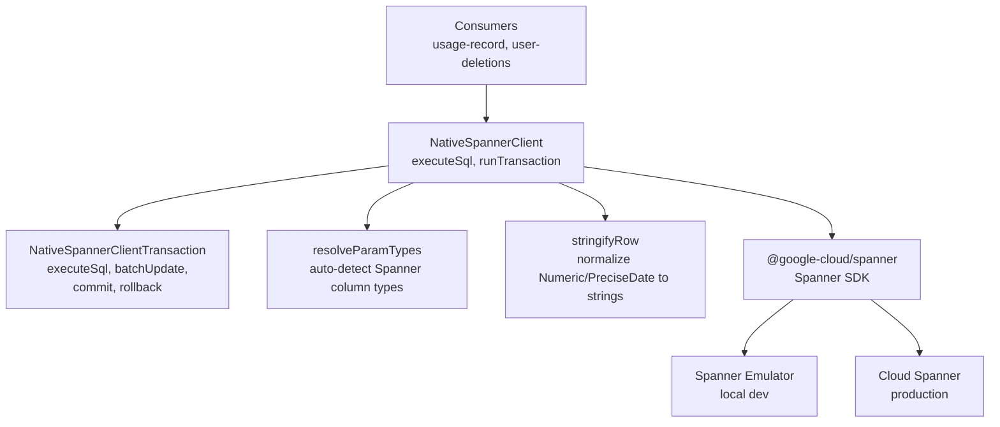

# Spanner

Native Google Cloud Spanner client for OpenRouter. Wraps `@google-cloud/spanner` to provide a typed query interface compatible with the `SpannerClient` contract defined in `packages/usage-record`, with row stringification to match the REST API behavior expected by downstream Zod schemas.

## Architecture

## Key Modules

| File | Purpose |
|------|---------|
| `native-spanner-client.ts` | `NativeSpannerClient` — typed query execution, transactions, and row stringification |
| `native-spanner-client-transaction.ts` | `NativeSpannerClientTransaction` — read/write transaction with `executeSql`, `batchUpdate`, `commit`, `rollback` |
| `resolve-param-types.ts` | Auto-detects Spanner parameter types from JavaScript values |
| `integration/` | Integration tests against the Spanner emulator |

## Commands

| Command | Description |
|---------|-------------|
| `bun run test` | Run unit tests |
| `bun run test:integration` | Run integration tests against Spanner emulator |
| `bun run typecheck` | Type-check with tsgo |
