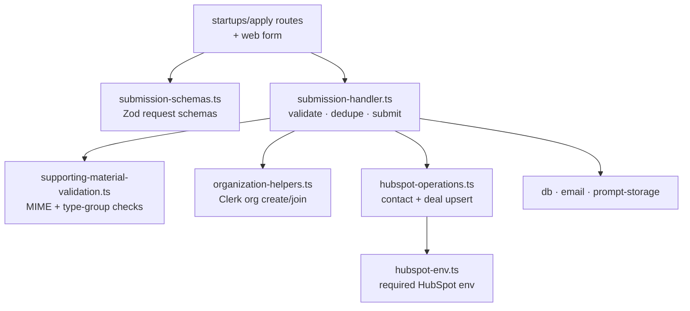

# startups

Shared logic for OpenRouter's startup-program application flow. Holds the Zod submission schemas, supporting-material validation, the submission handler, HubSpot contact/deal sync, and organization helpers — split out of `projects/web` so the `cfw-frontend-api` `startups/apply` routes and the web form can share one implementation.

## Architecture

## Commands

| Command | Description |
|---------|-------------|
| `bun test` | Run unit tests |
| `bun run typecheck` | Type-check |
