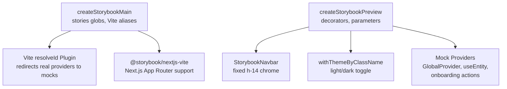

# Storybook Utils

Shared Storybook configuration, mocks, and styles for OpenRouter packages. Provides factory functions that produce consistent Storybook `main` and `preview` configs, a shared navbar chrome, and mock providers so a single unified Storybook (`projects/storybook`) can render stories from across the monorepo.

## Architecture

## Key Modules

| File | Purpose |
|------|---------|
| `src/create-main.ts` | Factory for Storybook `main` config — stories, framework, Vite aliases, mock resolution plugin |
| `src/create-preview.tsx` | Factory for Storybook `preview` config — decorators (navbar, theme, providers), parameters |
| `src/StorybookNavbar.tsx` | Shared fixed navbar matching production's `h-14` chrome |
| `mocks/` | Mock implementations for GlobalProvider, useEntity, onboarding actions, db workspace IDs |

## Commands

| Command | Description |
|---------|-------------|
| `tsgo --noEmit` | Type-check |
