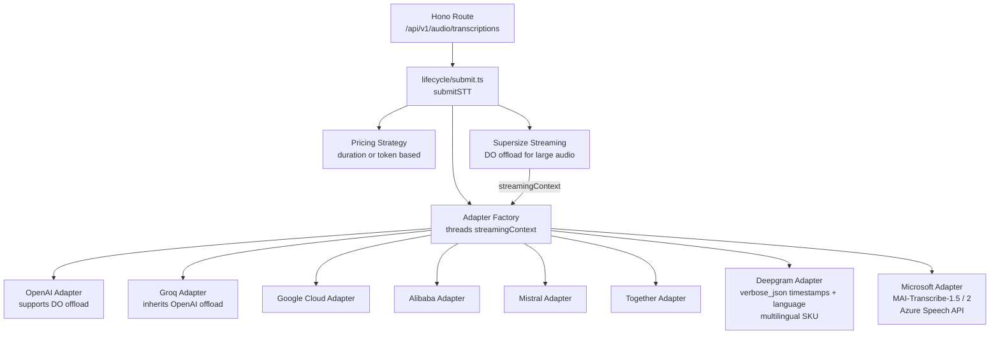

# STT (Speech-to-Text)

Provider-agnostic speech-to-text transcription engine. Receives audio via a unified API, routes to the best available provider adapter, and normalizes responses into a standard format with duration-based billing.

## Architecture

## Feature Catalog

[`lifecycle/definition.ts`](lifecycle/definition.ts) is the executable catalog: plain objects name each feature's status, real binding, and rationale. The shared [`SurfaceLifecycleFeatures`](../routing/lifecycle/feature-declaration.ts) type requires all fourteen lifecycle and policy decisions; `satisfies` checks completeness.

The declaration owns guard order, binds model access to the existing ban and attestation guards, and reuses the standard data-policy, BYOK, and HIPAA routing bindings. Broadcast and private logging share the same observability scheduler. `submit.ts` consumes these existing owners while keeping resolution, authorization, fallback, and charge cleanup as ordinary calls; the catalog introduces no new policy behavior.

The declaration records missing content filtering ([ECO-4023](https://linear.app/openrouter/issue/ECO-4023)) and moderation ([ECO-4024](https://linear.app/openrouter/issue/ECO-4024)) for caller-supplied text such as `provider.options.alibaba.system_prompt`. These are tracked gaps, not inapplicable features; no new text, audio, or output policy is enabled by the catalog.

## Key Modules

| Path | Purpose |
|------|---------|
| `app.ts` | Hono app factory; wires route + middleware |
| `lifecycle/submit.ts` | Core transaction loop: auth, routing, billing, usage recording (`submitSTT`) |
| `lifecycle/definition.ts` | Feature catalog with executable bindings and ordered model + endpoint guards |
| `lifecycle/context.ts` | Per-request `STTCtx` / shared lifecycle types and `createSTTCtx` |
| `lifecycle/capabilities.ts` | `STTCapabilities` + `createSTTCapabilities` |
| `lifecycle/resolve.ts` | Model + candidate-endpoint resolution and ranking |
| `lifecycle/invoke.ts` | Adapter build, provider call, parse, and failure observation |
| `lifecycle/finalize.ts` | Transcript pricing and the async billing tail |
| `routes/transcribe.ts` | OpenAPI route definition and request handler; accepts both JSON and OpenAI-style `multipart/form-data` bodies |
| `routing/steps.ts` | Endpoint routing steps in execution order |
| `adapters/base.ts` | Abstract base class; holds `streamingContext` for DO offload gating |
| `adapters/adapter-factory.ts` | Maps `STTAdapterName` to adapter instances; threads `streamingContext` by `fetchOffloadKey` match |
| `adapters/capabilities.ts` | Per-adapter feature matrix (formats, diarization, streaming, offload support, `verbose_json` response format) |
| `adapters/deepgram/` | Deepgram adapter: `verbose_json` word timestamps and detected `language`, multilingual detection (billed on its own SKU), and `mip_opt_out` provider option |
| `adapters/microsoft/` | Azure Speech adapter: `enhancedMode` pinned to the endpoint's MAI-Transcribe model; `verbose_json` maps `timestamp_granularities` to `enhancedMode.modelOptions.timestamps` and returns phrase `segments` (with `speaker` when `provider.options.azure.diarization` is enabled) and `words`. MAI-Transcribe-1.5 is deny-listed for `verbose_json` because Azure rejects timestamps and diarization on it |
| `helpers/` | Preflight checks, base64 size estimation, tx init, logging, heartbeat response streaming, multipart request parsing (`parse-multipart-transcription-request.ts`), adapter-name resolution |

## Adding a New Provider

1. Create `adapters/<provider>/index.ts` extending `BaseSTTAdapter`
2. Add response schema in `adapters/<provider>/response-schema.ts`
3. Register enum in `packages/enums` (`STTAdapterName`, `PricingStrategyName`)
4. Add pricing strategy in `packages/pricing/strategies/stt/`
5. Wire into `adapters/adapter-factory.ts`
6. Add test fixtures in `adapters/<provider>/fixtures/`

## Commands

| Command | Description |
|---------|-------------|
| `bun test` | Run unit tests |
| `tsgo --noEmit` | Type-check |
