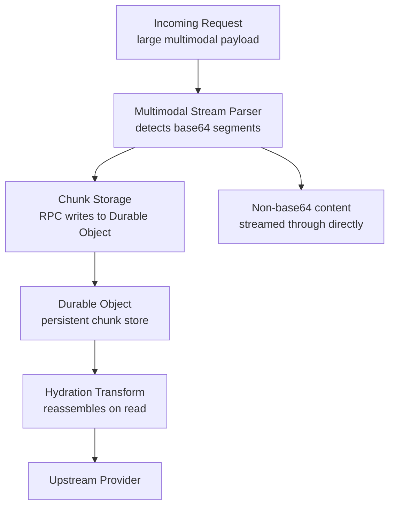

# Supersize Streaming

Durable Object-backed streaming infrastructure for offloading large request/response payloads in Cloudflare Workers. Handles multimodal content (base64 images, audio, video) that would exceed Worker memory limits by chunking and storing data in Durable Objects during streaming.

## Architecture

## Key Modules

| File | Purpose |
|------|---------|
| `multimodal-stream-parser.ts` | Detects and extracts base64 segments from streaming JSON, routes to DO storage |
| `chunk-storage.ts` | Manages chunked RPC writes to Durable Objects with timing and throughput metrics |
| `hydration-transform.ts` | Reassembles chunked content from DO storage on the read path |
| `process-stream-json.ts` | Entry point for the CFW stream processing pipeline |
| `setup-streaming-request-if-needed.ts` | Shared decision logic for whether an incoming request should use the streaming parser (offload header, content-length thresholds, data-region jurisdiction) — consumed by the API workers instead of each duplicating the setup |
| `data-format-parser.ts` | Parses multimodal data format headers (base64, URL references) |
| `json-sax.ts` | SAX-style streaming JSON parser for incremental processing |
| `multipart-assembler.ts` | Assembles multipart/form-data from streamed chunks |
| `offload-remote-content.ts` | Fetches and offloads remote URL content into DO storage |
| `aws-signing.ts` | AWS SigV4 request signing for S3/Bedrock integrations |
| `request-context.ts` | Per-request streaming context (DO binding, chunk metadata) |

## Observability

Chunk write timing uses `performance.now()` for sub-millisecond precision. Throughput metrics (`transfer_mib`, `transfer_mib_per_second`, `duration_ms`) are included in both `iLog` entries and `breadcrumbs()` calls to survive Cloudflare tail worker log limits.

The hydration read loop emits one cumulative `hydration-read:complete` summary per generator execution (in a `try/finally` block so stats survive request cancellation, with `loop_completed: false` marking an interrupted read). It does not log per batch or per row: one interrupted request must leave one record. All logging goes through `iLog` / `wLog` / `eLog`, never `console.log`, so the HIPAA mirror's scrubbing logger applies to every line the Durable Object emits. The shared logger writes to `console` synchronously (it does not defer through `waitUntil`), so a parallel raw `console.log` adds nothing on cancelled requests: the `try/finally` placement is what guarantees the record, not the logging call.

When the runtime rejects the DO fetch with `Durable Object reset because its code was updated` or `this Durable Object instance is no longer active`, the Worker replaces the `ProcessStreamJson` stub for the same DO ID and returns the rejection (`fetch-offloaded-request.ts`). The upstream POST is not re-sent at this boundary because the provider may already hold it: the router's endpoint fallback owns re-dispatch, and it now runs on a working stub. Chunk writes use the same classification and retry up to three times (`store-chunks-with-retry.ts`). `Durable Object is overloaded` is never retried.

## Commands

| Command | Description |
|---------|-------------|
| `bun test` | Run unit tests (bun runtime) |
| `vitest run -c vitest.worker.config.mts` | Run Cloudflare Worker-scoped tests |
| `tsgo --noEmit` | Type-check |
