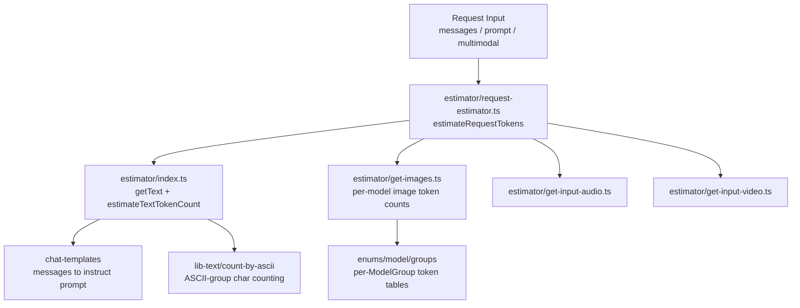

# Token Utils

The request token estimator for OpenRouter. Turns an incoming request (messages, prompt, images, audio, video) into estimated input token counts used for budgeting, max-price checks, and pre-flight cost estimation before a generation runs.

## Architecture

## Key Modules

| Path | Purpose |
|------|---------|
| `estimator/request-estimator.ts` | Top-level estimator that sums text, image, audio, and video token estimates for a request |
| `estimator/index.ts` | Text extraction and estimation (`getText`, `estimateTextTokenCount`, reasoning token estimate) plus per-`ModelGroup` image token tables |
| `estimator/get-images.ts` | Per-image token counts. `image_url.detail` (`low`/`high`/`original`) selects between the model group's min and max per-image budget; `original` and `high` use the max tier |
| `estimator/get-input-audio.ts` / `get-input-video.ts` | Audio/video input token estimation |

## Commands

| Command | Description |
|---------|-------------|
| `bun test` | Run unit tests |
| `bun run test:watch` | Run tests in watch mode |
| `bun run typecheck` | Type-check with tsgo |
