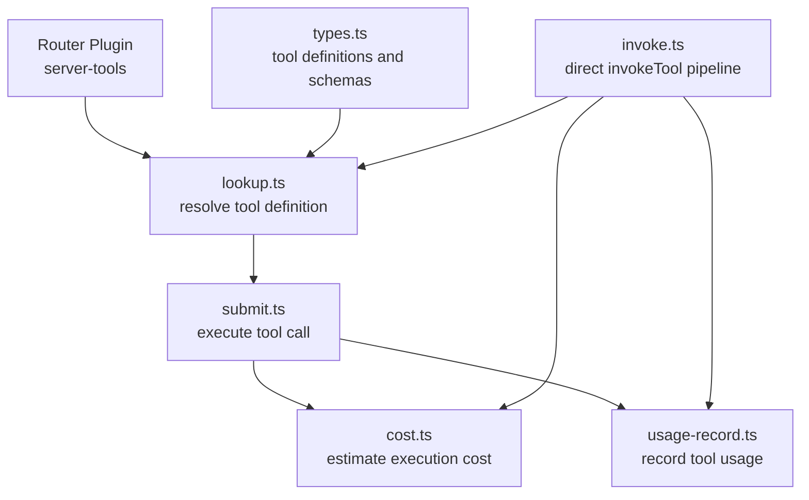

# Tools

Server-side tool execution engine for OpenRouter's tool-use capabilities. Handles tool call lifecycle: lookup, cost estimation, submission, and usage recording for tools invoked during LLM interactions.

## Architecture

## Key Modules

| File | Purpose |
|------|---------|
| `lookup.ts` | Resolves tool names to their definitions and execution endpoints |
| `invoke.ts` | End-to-end `invokeTool()` pipeline — lookup, execute, cost, and record in one call |
| `submit.ts` | Executes tool calls against provider endpoints |
| `cost.ts` | Estimates and calculates tool execution costs |
| `usage-record.ts` | Records tool usage for billing and analytics |
| `types.ts` | Shared type definitions for tool interfaces |

## Commands

| Command | Description |
|---------|-------------|
| `bun test` | Run unit tests |
| `bun test --watch` | Run tests in watch mode |
| `tsgo --noEmit` | Type-check |
