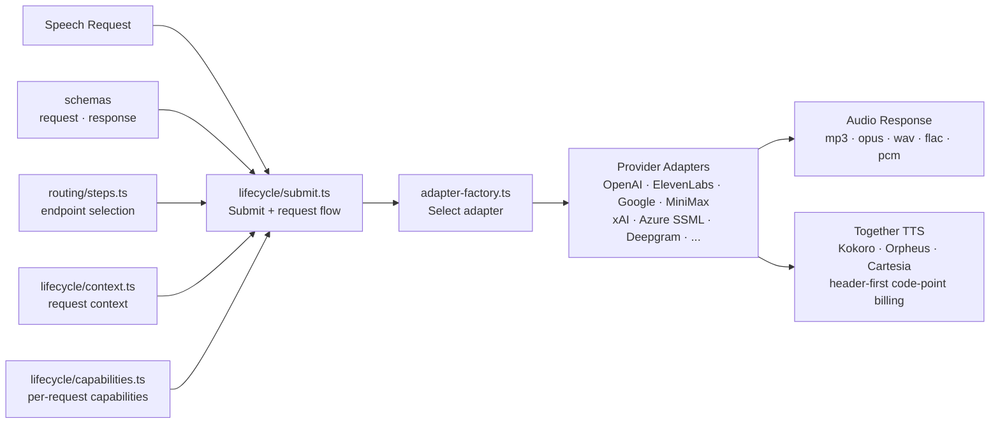

# TTS

Text-to-speech adapter layer. Routes speech synthesis requests to provider-specific adapters (OpenAI, ElevenLabs, Google, xAI/Grok, etc.), normalizes request/response formats, and handles audio format negotiation.

## Architecture

## Key Modules

| Path | Purpose |
|------|---------|
| `app.ts` | Hono application setup |
| `lifecycle/submit.ts` | Request handling flow (`submitTTS`) |
| `lifecycle/context.ts` | Per-request context and shared lifecycle types |
| `lifecycle/capabilities.ts` | Per-request capabilities (billing, rate limiting, recording) |
| `lifecycle/guards.ts` | Content-filter, moderation, and estimated-cost authorization implementations |
| `lifecycle/definition.ts` | Executable catalog: fourteen feature decisions and ordered request/model/endpoint guards |
| `lifecycle/resolve.ts` | Model and endpoint resolution |
| `lifecycle/invoke.ts` | Provider invocation and adapter construction |
| `lifecycle/finalize.ts` | Stream finalization and billing handoff |
| `adapters/` | Per-provider TTS adapters; the Deepgram adapter maps voices to per-voice models and supports `mip_opt_out` |
| `schemas/request/` | Request validation schemas |
| `schemas/response/` | Response format schemas |
| `routing/steps.ts` | Endpoint selection and routing |

## Commands

| Command | Description |
|---------|-------------|
| `bun test` | Run unit tests |
