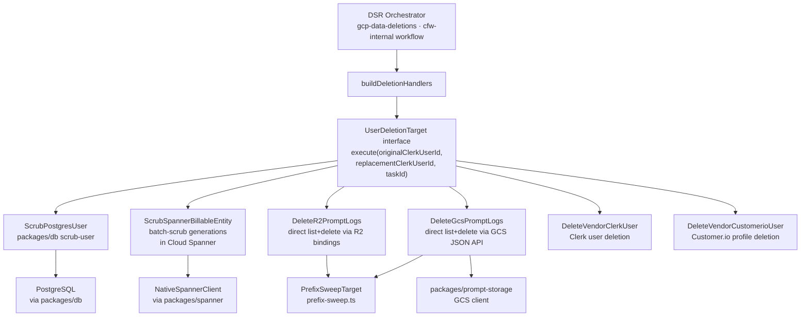

# User Deletions

Data Subject Request (DSR) deletion targets for OpenRouter. Each target implements the `UserDeletionTarget` interface to scrub personally identifiable data from a specific storage backend, replacing it with a pseudonymized replacement user ID.

Targets are shared across orchestrators: the `gcp-data-deletions` graphile worker and the `cfw-internal` `UserDeletionWorkflow` both build their handler set from `buildDeletionHandlers`. Only cfw-internal has R2 bucket bindings, so it is the only orchestrator that can complete `delete_r2_prompt_logs`; Mission Control routes new deletions there.

## Architecture

## Key Modules

| File | Purpose |
|------|---------|
| `user-deletion-target.ts` | `UserDeletionTarget` interface — the contract every deletion backend implements |
| `build-handlers.ts` | `buildDeletionHandlers` — constructs the `UserDeletionTargetName → UserDeletionTarget` map shared by every orchestrator |
| `scrub-postgres-user.ts` | `ScrubPostgresUser` — delegates to `packages/db` to scrub user records in Postgres |
| `scrub-spanner-billable-entity.ts` | `ScrubSpannerBillableEntity` — batch-scrubs generation rows in Spanner, respecting shard IDs, generated columns, and override columns |
| `delete-vendor-clerk-user.ts` | `DeleteVendorClerkUser` — deletes the user from Clerk via the Clerk Backend API |
| `delete-vendor-customerio-user.ts` | `DeleteVendorCustomerioUser` — deletes the user profile from Customer.io |
| `prefix-sweep.ts` | `sweepPrefixes` — paged list+delete of every object under a set of prefixes in one bucket, bounded by a per-invocation page budget |
| `prefix-sweep-target.ts` | `PrefixSweepTarget` — shared target that rejects org members and blank IDs, then sweeps `${clerkUserId}/` and `_trash/${clerkUserId}/` in each bucket; returns `polling` when the page budget runs out |
| `org-membership-check.ts` | `rejectOrgMembers` — fails the target for users in any org, since org-context prompt logs are not under the user prefix |
| `gcs/delete-gcs-prompt-logs.ts` | `DeleteGcsPromptLogs` — sweeps `global-private-prompt-data` through the GCS JSON API (`packages/prompt-storage/gcs/client.ts`) |
| `r2/delete-r2-prompt-logs.ts` | `DeleteR2PromptLogs` — sweeps the three prompt-log buckets through Worker R2 bindings; only constructible on cfw-internal, so `buildDeletionHandlers` takes it as a dependency |
| `not-implemented-target.ts` | `NotImplementedTarget` — settles a target as failed on runtimes that cannot run it (the R2 target on `gcp-data-deletions`) |

## Commands

| Command | Description |
|---------|-------------|
| `bun run test` | Run unit tests |
| `bun run typecheck` | Type-check with tsgo |
