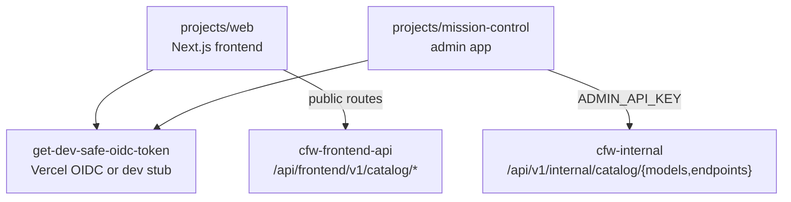

# Vercel Helpers

Vercel-specific utilities for the Next.js apps: the OIDC token helper used by
`projects/web` and `projects/mission-control`.

`projects/web` reads models, endpoints, providers, and authors through the public,
unauthenticated `cfw-frontend-api` catalog routes (see `projects/web/AGENTS.md`
→ Public page rendering). `projects/mission-control` reads the full catalog
through authenticated `cfw-internal` routes
(`projects/mission-control/utils/helpers/cfw-internal-catalog.ts`).

## Architecture

## Key Files

| File | Purpose |
|------|---------|
| `get-dev-safe-oidc-token.ts` | Returns a real Vercel OIDC token in production, or a dev stub locally |

## Commands

| Command | Description |
|---------|-------------|
| `bun test` | Run unit tests |
| `tsgo --noEmit` | Type-check |
