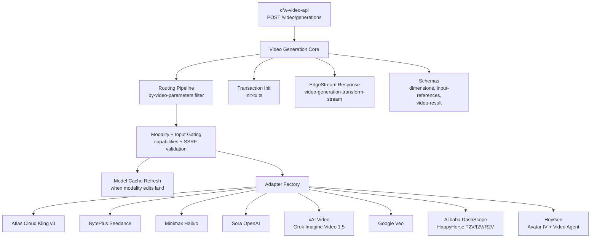

# Video Generation

Async video generation API for OpenRouter. Handles request validation, provider adapter selection, transaction initialization, and response streaming for video generation endpoints. Supports multiple providers (see `adapters/` for the current set) with audio and video input references.

## Architecture

## Key Modules

| Directory | Purpose |
|-----------|---------|
| `adapters/` | Per-provider video generation adapters (one directory per provider under `adapters/`). The xAI adapter supports Grok Imagine Video 1.5 (text- and image-to-video) with dedicated upstream-error parsing. The HeyGen Avatar IV adapter maps the request `aspect_ratio` to HeyGen's dimension shape. Shared `adapters/require-prompt.ts` enforces the prompt-required precondition for adapters that need one |
| `lifecycle/` | Request lifecycle: `definition.ts` declares the fourteen lifecycle features and guard order; `policy-features.ts` binds the video routing-policy variant; `context.ts` builds `VideoGenerationCtx`; `capabilities.ts` assembles model-call/rate-limit/billing capabilities; `resolve.ts` validates the model slug, runs model guards, and resolves the routed endpoint; `authorize.ts` enforces data residency and authorizes spend; `submit.ts` orchestrates submission (request guards, restrictions, rate limiting, moderation, validation, cost auth, enqueue); `enqueue.ts` builds the durable-object handoff payload and invokes the job; `validate-references.ts` runs SSRF checks on reference URLs |
| `proxy-video-content.ts` | Proxies completed-job video content from the upstream provider (not part of the submission lifecycle) |
| `routing/` | Endpoint filtering by video parameters (resolution, aspect ratio, duration) |
| `schemas/` | Zod schemas for dimensions, input references (audio + video URLs), and video results |
| `helpers/` | Transaction initialization, EdgeStream creation, and transform streams |
| `configs/` | Adapter name resolution |

## Lifecycle Definition

[`lifecycle/definition.ts`](lifecycle/definition.ts) declares all fourteen lifecycle obligations and retains the admission guard order. `startJob` is ordinary handoff plumbing, not a feature binding. The catalog shares routing bindings through [`policy-features.ts`](lifecycle/policy-features.ts) and durable-job bindings through [`job-features.ts`](lifecycle/job-features.ts), whose implementations are consumed directly by the routing list and worker event handlers.

The job awaits `jobStarted` to acquire existing reservations, `generationSettled` to submit prepared usage and schedule enabled observability, and `jobFinalized` to release reservations after terminal status and webhook handling. Recovery cleanup uses the same finalization handler. These are in-process function calls at the existing boundaries, not an event bus, queue, or parallel listener system; no new callback overrides are passed by the job. Event declarations do not prove successful delivery or exactly-once execution. `fallback` remains `notImplemented`, tracked by [ECO-250](https://linear.app/openrouter/issue/ECO-250).

## Commands

| Command | Description |
|---------|-------------|
| `bun run test` | Run unit tests |
| `bun run typecheck` | Type-check with tsgo |
