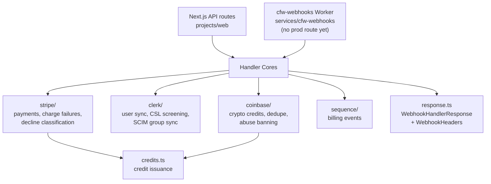

# Webhook Handlers

Framework-agnostic webhook handler cores shared by the Next.js API routes (`projects/web`) and the `cfw-webhooks` Cloudflare Worker. Each handler takes plain headers/body input and returns a `WebhookHandlerResponse` (`statusCode` + JSON `body`) that either host serializes into its own response type, so webhook business logic lives in one place regardless of runtime.

> **The two hosts are not both live.** Production webhook traffic is served only by the Next.js routes on Vercel; no production route points at `cfw-webhooks` yet (see `services/cfw-webhooks/AGENTS.md`). A change here affects production through the Next.js host, and instrumentation added to the worker produces no production signal.

## Architecture

## Key Modules

| Path          | Purpose                                                                                                                        |
| ------------- | ------------------------------------------------------------------------------------------------------------------------------ |
| `response.ts` | Framework-agnostic response (`WebhookHandlerResponse`) and header (`WebhookHeaders`, `getHeader`) types shared by all handlers |
| `credits.ts`  | Credit issuance helpers shared by payment webhook handlers; threads card/crypto and Cloudflare client payment signals onto issued credit rows                                                                     |
| `stripe/`     | Stripe webhook core: event schemas, charge-failed helpers, decline-class classification, payment source matching, `billing-origin.ts` / `charge-signals.ts` (persist card + Radar risk signals), and credit-insert metrics               |
| `clerk/`      | Clerk webhook core: user lifecycle sync (resilient `user.created` handling with an autogen-email fallback that scores and persists the signup-email autogen score, deferred signup classification and welcome-email suppression for SCIM-provisioned users, persisting sealed signup-CF integrity metadata/status flags on users), account-ban sync that dual-writes `account_ban` into `packages/db` restrictions, CSL sanctions screening, SCIM group sync                                              |
| `coinbase/`   | Coinbase Commerce webhook core: credit issuance with duplicate acknowledgement, crypto payment signals, and crypto-abuse banning                        |
| `sequence/`   | Sequence billing webhook handler                                                                                               |

## Commands

| Command         | Description    |
| --------------- | -------------- |
| `bun test`      | Run unit tests |
| `tsgo --noEmit` | Type-check     |
