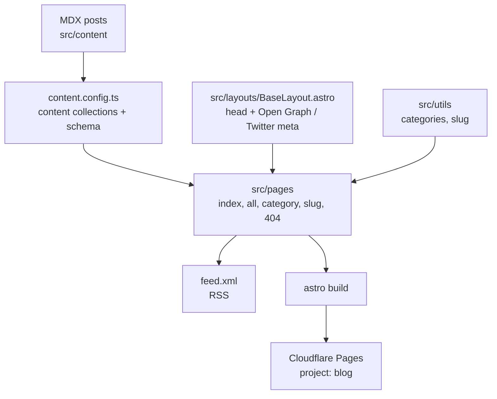

# Blog

OpenRouter's marketing/announcements blog. A static [Astro](https://astro.build/)
site that renders MDX posts grouped into categories and deploys to Cloudflare
Pages.

## Architecture



## Post dates

`date` is the publication date and never changes. When a post gets a substantive revision, add `updated` (ISO date, on or after `date`):

```yaml
date: "2026-03-01T00:00:00.000Z"
updated: "2026-09-15T00:00:00.000Z"
```

`updated` renders an "Updated" label in the byline, sets `dateModified` in the `BlogPosting` JSON-LD and `article:modified_time`, and becomes the post's sitemap `lastmod` (generated by `projects/web/app/sitemap-data.ts`). Posts without `updated` keep `date` for all three. Sorting stays by `date`. The value is stored in front matter rather than derived from git because the blog deploy and Cloudflare Pages previews check out with depth 1, so there is no history at build time; bump it by hand when you revise a post.

## Inline newsletter CTA

Posts in the `insights` category (the blog has no separate data category, so data posts live there) get one inline newsletter signup inserted at build time by `src/lib/newsletter-cta/remark-newsletter-cta.ts`. It lands after the second H2, falling back to after the first H2, then the end of the article. The static shell ships hidden. `src/lib/newsletter-cta/client.ts` (booted from `src/lib/newsletter/initialize.ts` alongside the footer form and popup) fetches the `web_inline_data_article` unit from the public capture-units API, fills the eyebrow, headline, body, and button label as text nodes, reveals the CTA, and wires dismiss plus the shared `src/lib/newsletter` submit, Turnstile, storage, and analytics helpers. Nothing renders when the unit is missing or disabled, when the visitor dismissed any capture unit in the last 14 days, or when the visitor already subscribed. Creative copy is managed in Mission Control under Admin utils, Email capture.

Author controls in front matter:

```yaml
newsletter_cta: false                          # no CTA on this post
newsletter_cta:
  placement: after-h2:3                        # or `end`
  teaser: One line shown above the headline.   # optional
  count: 2                                     # optional second CTA at the end (hard cap of two)
```

To position the CTA by hand, put the HTML comment `<!-- newsletter-cta -->` on its own line in the Markdown body. Each marker becomes a CTA in place (up to two) and suppresses automatic insertion. Markers work in any category.

## Commands

| Command | Description |
|---------|-------------|
| `bun run dev` | Start the Astro dev server on port 4323 |
| `bun run build` | Build the static site to `./dist` |
| `bun run preview` | Preview the production build locally |
| `bun run deploy` | Build and deploy `./dist` to the `blog` Cloudflare Pages project |

## Newsletter environment

The footer form and popup in `src/lib/newsletter` call the public newsletter routes on cfw-frontend-api. These build-time `PUBLIC_*` variables control them. The blog workflow exports `PUBLIC_POSTHOG_KEY` and `PUBLIC_NEWSLETTER_TURNSTILE_SITE_KEY` from Infisical, so add any new variable to `.github/workflows/blog.yaml` and `env.manifest.json` under `/projects/blog` before relying on it in a deploy. `PUBLIC_NEWSLETTER_TURNSTILE_SITE_KEY` is required on production builds and the workflow fails without it; the rest are optional.

| Variable | Default | Description |
|----------|---------|-------------|
| `PUBLIC_NEWSLETTER_API_BASE` | `https://openrouter.ai` | Origin the capture-units and subscribe requests are sent to. Set it on preview builds to target staging instead of production. |
| `PUBLIC_NEWSLETTER_TURNSTILE_SITE_KEY` | unset locally, required in prod | Cloudflare Turnstile site key, read from `/projects/blog` in the prod Infisical environment. Both forms render the widget and send `turnstile_token` when it is set; the subscribe route rejects submissions without a token. |
