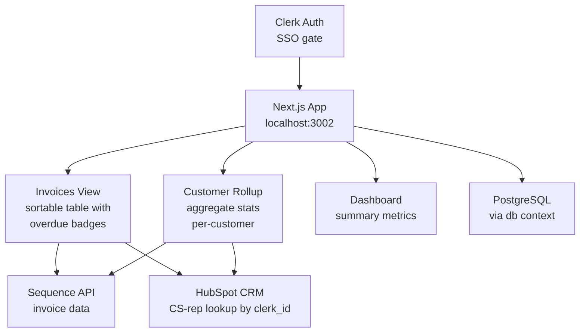

# Invoice Tracker

Internal Next.js app for Finance and Customer Success teams to track and manage overdue invoices. Pulls invoice data from Sequence, enriches it with CS-rep assignments from HubSpot, and presents sortable invoice and customer rollup views behind Clerk auth.

## Architecture

## Key Directories

| Path | Purpose |
|------|---------|
| `app/invoices/` | Invoices list and detail pages |
| `app/customers/` | Per-customer rollup view |
| `app/dashboard/` | Summary dashboard page |
| `app/components/` | Shared UI: `InvoiceTable`, `CustomerTable`, `DaysOverdueBadge`, `InvoiceStatusBadge`, `DegradedDataBanner` |
| `lib/hubspot.ts` | HubSpot CRM client with rate-limit retries for CS-rep lookups |
| `lib/enrichment.ts` | Joins invoice data with HubSpot CS-rep info |
| `lib/sequence.ts` | Sequence API client for invoice data |
| `lib/types.ts` | Core types: `EnrichedInvoice`, `CustomerRollup`, `CsRepInfo` |
| `middlewares/` | Request middleware (auth checks) |

## Commands

| Command | Description |
|---------|-------------|
| `pnpm dev invoice-tracker` | Start local dev server |
| `bun test` | Run unit tests |
| `bun run typecheck` | Type-check with tsgo |
| `bun run build` | Production build |
