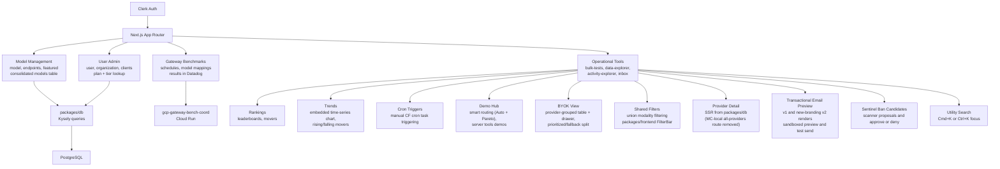

# Mission Control

Internal admin dashboard for OpenRouter. Provides model management, endpoint configuration, user administration, gateway benchmarking, and operational tooling for the platform team.

## Architecture

## Key Areas

| Route                              | Purpose                                                                                                                                                                                                                                                                                                                                         |
| ---------------------------------- | ----------------------------------------------------------------------------------------------------------------------------------------------------------------------------------------------------------------------------------------------------------------------------------------------------------------------------------------------- |
| `model/`, `models/`                | Model registry, endpoint configuration, pricing, and model preview generation/curation (server-workflow previews with manual example curation). Multi-modality models run their test suites across every API surface (`build complete multi-modality test suites per API`), with full test-result text collapsed by default                     |
| `endpoint/`, `endpoints/`          | Provider endpoint management, status, and per-endpoint STT/TTS test popovers                                                                                                                                                                                                                                                                    |
| `user/`, `organization/`           | User lookup, entitlements, org management with full-precision usage/credits display                                                                                                                                                                                                                                                             |
| `gateway-benchmarks/`              | Benchmark schedules and model mappings; results link to Datadog                                                                                                                                                                                                                                                                                       |
| `activity-explorer/`               | Generation activity and usage analytics (overview charts, rankings leaderboards, trends with time series charts)                                                                                                                                                                                                                                |
| `data-explorer/`                   | Ad-hoc data querying                                                                                                                                                                                                                                                                                                                            |
| `benchmarks/`                      | Model quality benchmarks; the results viewer supports full-run viewing, concurrent chunk auto-loading (newest-first in live mode), paginated samples with score/epoch filters, copyable sample ids without reload-on-filter, and focused viewer modules (trajectory, metadata, samples table)                                                   |
| `admin-utils/`                     | Internal admin utilities (API key lookup with activity/trends tabs, transfer credits, app explorer, demo hub, gateway benchmarks card, ban/unban with Force option — all ban interfaces accept newline/space/comma-delimited input, cron triggers, test-in write-path smoke test with primary DB selection)                                     |
| `admin-utils/delete-r2-logs/`      | GDPR/DSR log deletion by API key — batched preview scan and deletion paginate in small pages to stay under the 30s server-action timeout, terminating only on an empty page                                                                                                                                                                     |
| `admin-utils/cron-triggers/`       | Manual cron trigger UI — lists all CF cron tasks with schedules, triggers via OIDC-authenticated POST to cfw-internal                                                                                                                                                                                                                           |
| `admin-utils/demo-hub/`            | Interactive demo environment for customer engineering presentations (smart routing with Auto + Pareto Code Router toggle, server tools)                                                                                                                                                                                                         |
| `admin-utils/pareto-routers/`      | View production tiers for Pareto-created routers (currently Pareto Code) and draft custom tier rules from AA or Design Arena benchmarks                                                                                                                                                                                                         |
| `admin-utils/enterprise-pipeline/` | Enterprise account setup (including Business tier) and scheduled plan tier changes                                                                                                                                                                                                                                                              |
| `admin-utils/credit-expiration/`   | Credit expiration workflow UI (now driving the promoted live workflow, not dry-run only) — lists runs in a paginated Past Runs table (5 per page), inspects per-user summaries with tier histograms (including a $0.00–$0.01 bin), validation drop-outs, and the ClickHouse-vs-Pg+Spanner amount diff, and exports completed runs as zipped CSV |

## Commands

| Command                     | Description                                                                             |
| --------------------------- | --------------------------------------------------------------------------------------- |
| `bun run dev`               | Start dev server (port 3001, secrets via Infisical, real GCS via Infisical credentials) |
| `bun run dev::gcs-emulator` | Same, but GCS points at local fake-gcs (used by the `mission-control` Tilt resource)    |
| `bun run build`             | Production build                                                                        |
| `bun run test`              | Run unit tests                                                                          |
| `bun run typecheck`         | Type-check with tsgo                                                                    |

Note on GCS in local dev: under Tilt, Mission Control talks to the local fake-gcs emulator
(`GCS_API_ENDPOINT=http://localhost:4443`, bucket `benchmark-results-dev`), so benchmark
artifacts come from the emulator, which starts empty. To browse
real dev-project GCS artifacts instead, run `bun run dev` directly, which uses the Infisical
credentials and buckets.
