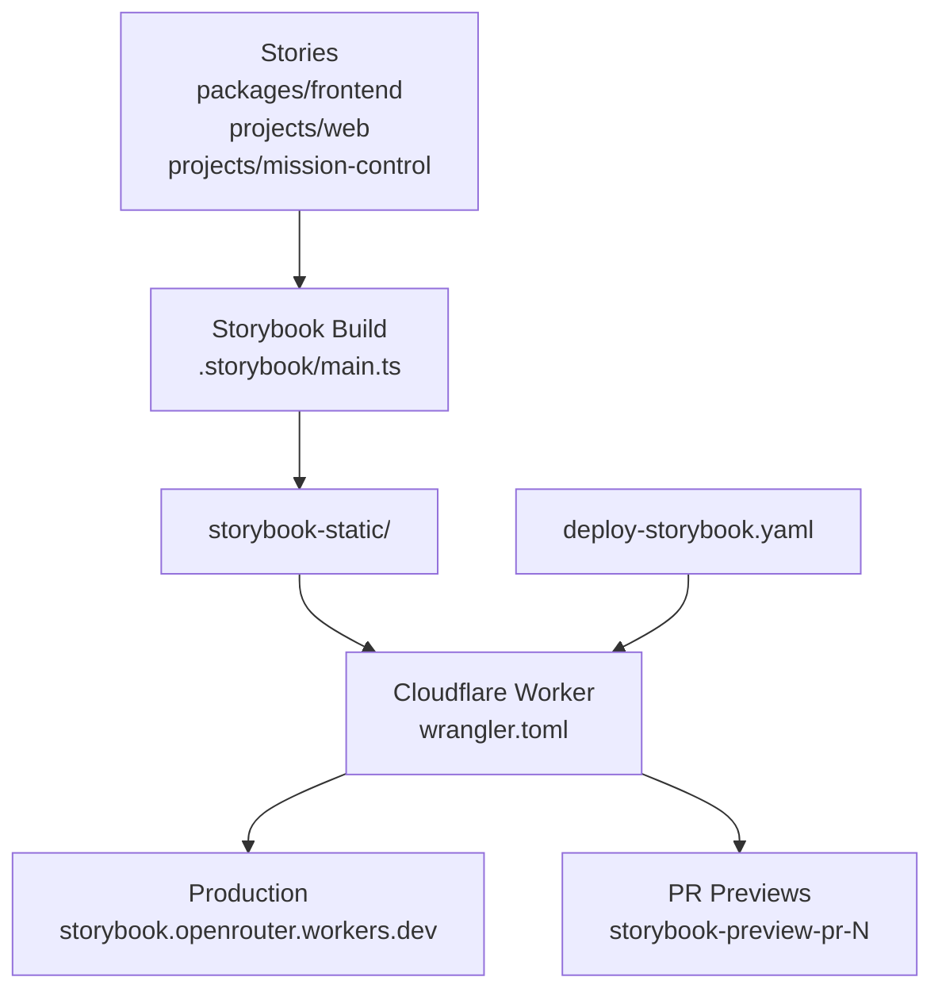

# Storybook

Unified Storybook build for OpenRouter's component library. Consolidates stories from `packages/frontend`, `projects/web`, and `projects/mission-control` into a single project deployed as a Cloudflare Worker with static assets.

## Architecture

## Commands

| Command | Description |
|---------|-------------|
| `bun run storybook` | Start dev server on port 6006 |
| `bun run storybook:build` | Build static output to `storybook-static/` |
| `bun run typecheck` | Type-check with tsgo |

## Deployment

- **Production**: Deploys to `storybook.openrouter.workers.dev` on push to `main` (gated to storybook config and story file paths)
- **PR previews**: Deploy as `storybook-preview-pr-{number}` workers when the `storybook-preview` label is applied; torn down on PR close
- Uses existing `CF_WORKERS_API_TOKEN` (no new secrets needed)
