# Web

Public-facing Next.js dashboard for OpenRouter. Provides the marketplace, model comparison, playground, activity/logs dashboards, API key management, workspace settings, and user account pages. The Bauhaus visual rebrand (v2 design system) is the site-wide look; see `DESIGN.md` for the design language.

## Architecture

```mermaid
graph TD
    Clerk["Clerk Auth"] --> App["Next.js App Router"]
    App --> Marketplace["Marketplace\nmodels, compare, provider,\nauthor pages\nmodel families + spotlight"]
    App --> Dashboard["Dashboard\nactivity, logs, keys,\nworkspaces, settings"]
    App --> Playground["Playground + Fusion\nchat, artifacts, model selection\nshared history sidebar/drawer"]
    Dashboard --> Sidebar["Sidebar\nworkspace-aware nav\nwith activity/logs links"]
    Dashboard --> Filters["Filter Providers\nactivity + transaction filters\nwith Suspense fallback"]
    Dashboard --> Gates["Auth Gates\nLoggedInGate, OrgGate, AdminGate"]
    Marketplace --> Skeletons["Loading Skeletons\ncard + list item shells"]
    Playground --> BuiltInAI["Built-in AI\nauto-generated room titles"]
    Marketplace --> ModelList["Shared Model List\nVirtualizedModelList backs\nModelSelect, navbar search, Cmd+K"]
    Dashboard --> DB["packages/db"]
    Dashboard --> CfwApi["services/cfw-api"]
    Marketplace --> Discovery["Model Discovery\ntoday's signals carousel,\nmodality collection sheets"]
    Marketplace --> API["cfw-frontend-api\nall providers + examples\napp detail + author pages\n(no direct DB during SSR)"]
    App --> QuickStart["Quick Starts\nMeta reasoning + private models"]
    App --> Benchmarks["Benchmarks\ntau2 pages"]
    App --> AuthMeta["Sealed Signup\nCloudflare metadata relay\nclient fingerprints (ASN, JS, proxy)"]
    Playground --> Artifacts["Artifact Workspace\nrendering, composer, status, timestamps"]
    Marketplace --> BrowseComp["BrowseComp\nsearch benchmark leaderboard\nsticky benchmark header"]
    Dashboard --> Lineage["Activity and Logs Lineage\nserver-tool roots and workspace context"]
    Dashboard --> AnalyticsState["Analytics State\nsaved chart filters, date ranges,\ncreator and entity scope"]
```



## Key Areas

| Route / Feature                               | Purpose                                                                                                                                                                                                                                                                                                                                                                                                                                                                                                                                                                                                                                                                                                                                                                                       |
| --------------------------------------------- | --------------------------------------------------------------------------------------------------------------------------------------------------------------------------------------------------------------------------------------------------------------------------------------------------------------------------------------------------------------------------------------------------------------------------------------------------------------------------------------------------------------------------------------------------------------------------------------------------------------------------------------------------------------------------------------------------------------------------------------------------------------------------------------------- |
| `(marketplace)/models/`                       | Model listing with card skeletons and shared list item shell; table rows are fully clickable and the page (not the list/table) owns vertical scroll, with the header/filters pinned as sticky chrome above it. The virtualized models table supports a density preference and an opaque-hover columns chip; the forked per-table columns menus are retired in favor of the shared `packages/frontend` v2 table-settings menu. Persisted sort prefs are not applied when the sort controls are hidden                                                                                                                                                                                                                                                                                                                                                          |
| `(marketplace)/compare/`                      | V2 model comparison grid with responsive column layout and provider icons                                                                                                                                                                                                                                                                                                                                                                                                                                                                                                                                                                                                                                                                                                                     |
| `(marketplace)/[maker-id]/[slug]/`            | Model detail page. `ModelBanners` reuses the shared promotion banner for image-model promotions (single banner component across text and image promotions)                                                                                                                                                                                                                                                                                                                                                                                                                                                                                                                                                                                                                                     |
| `components/model-discovery/`                 | Model discovery page, now served at `/discover` (renamed from `/discover-alpha`) — `build-discovery-view.ts` assembles the view model from product-feedback-driven rules, frontier-card slots are earned from the intelligence index, and a static frontier header (narrative card + stat grid) leads the page. Lane lists render as real tables with column headers; modality icons carry per-category design-system tints; browse CTAs get button treatment with a live model count; PostHog instrumentation spans the page. Modality collections / lane details open as sheets (`ModalityGuide`, `LaneSheet`); the model detail sheet has an explicit view-model-page CTA                                                                                                                                                                                                                                                                                                                                                                                                                                 |
| `(home)/rankings/`                            | Rankings charts fetched from cfw-frontend-api (including stt/video modality charts); `LazyChartSection` defers offscreen chart work                                                                                                                                                                                                                                                                                                                                                                                                                                                                                                                                                                                                                                                           |
| `(marketplace)/providers/`                    | Providers listing backed by the cfw-frontend-api providers-listing endpoint                                                                                                                                                                                                                                                                                                                                                                                                                                                                                                                                                                                                                                                                                                                   |
| `(user)/(dashboard)/activity/`                | Guardrail false-positive reporting (GA), activity charts, filter popovers, API key pill with generation detail linking, prompt overlay deep-links (`?transaction=X&message=N`), rankings percentage toggle, hover-to-filter buttons on transaction table cells (`CellFilterButton`, including a filter context menu on the fusion router indicator), and native web search usage in the generation detail view                                                                                                                                                                                                                                                                                                                                                                                |
| `(user)/(dashboard)/logs/`                    | Generation logs with video playback error classification and download fallback; tables use page-level scroll with a sticky header pinned under the tab strip, the request histogram uses a compact y-axis gutter, and banners share the flat Banner shell                                                                                                                                                                                                                                                                                                                                                                                                                                                                                                                                                      |
| `(user)/(dashboard)/settings/`                | Organization members with client-side auth gates (LoggedInGate, OrgGate, AdminGate). The credits page has a route-level loading skeleton, derives its account subtitle client-side from Clerk session data (no backend hop), and caches overdue-invoice status per billable entity without caching transient lookup failures                                                                                                                                                                                                                                                                                                                                                                                                          |
| `(user)/(dashboard)/workspaces/`              | Workspace key management with bulk move, BYOK provider detail; the sidebar workspace switcher persists the active workspace via cookie                                                                                                                                                                                                                                                                                                                                                                                                                                                                                                                                                                                                                                                                                                                                 |
| `(user)/(dashboard)/labs/quality-tournament/` | LLM-judge quality tournament wizard; the redesigned wizard UI is now the default (feature flag removed)                                                                                                                                                                                                                                                                                                                                                                                                                                                                                                                                                                                                                                                                                       |
| `features/playground/`                        | Chat playground (Chrome Built-in AI summary titles). UI lives under `ui/`, state under `state/`. On mobile, surfaces (model pickers, add-model multi-select, server tools, room manager) render as side drawers with shared styles in `ui/mobile-drawer-classes.ts`, 16px touch fonts to prevent iOS zoom, and redesigned featured model cards. Image-only models are routed directly to `/api/v1/images` instead of chat completions. Chat bubble colors are user-configurable via a picker in room settings (`use-chat-bubble-color.ts`), and duplicate-room failures are surfaced to the user. The legacy V1 chatroom codepath is deleted — the V2 playground is the only chat surface |
| `(home)/benchmarks/tau2-bench-airline/`       | Public τ²-Bench airline leaderboard with model comparison charts (data via `packages/benchmarks-utils`)
| `components/` (model list)                    | Canonical model list: `VirtualizedModelList` backs the ModelSelect panel/drawer, the navbar search, and the Cmd+K palette (`components/search/`), with headless keyboard scroll-follow and navigation rows                                                                                                                                                                                                                                                                                                                                                                                                                                                                                                                                                                                    |
| `components/EntityPills/`                     | Reusable entity display components (ApiKeyPill with HoverCard)                                                                                                                                                                                                                                                                                                                                                                                                                                                                                                                                                                                                                                                                                                                                |
| `features/guardrails/`                        | Guardrail editor and creation takeover; the creation flow now requires an assignment, and workspace default / budget policy descriptions were reworded |


## Commands

| Command             | Description                                         |
| ------------------- | --------------------------------------------------- |
| `bun run dev`       | Start dev server (port 3000, secrets via Infisical) |
| `bun run build`     | Production build                                    |
| `bun run test`      | Run unit tests (node + DOM + isolated mocks)        |
| `bun run typecheck` | Type-check with tsgo                                |

## Running Vendors tests

The `vendors` folder contains tests for our vendor integrations. To run the test suite:

```bash
bun run test:vendors
```

To run the test suite in watch mode:

```bash
bun run test:vendors --watch
```

## Running E2E tests

The `e2e` folder contains end-to-end tests. It can be run against our prod or local instance of the API. Some E2E tests are "skipped" by default and should be selectively run.

Some tests rely on a predefined set of keys, which you must run `bun run db:reset` to re-seed the local db with the data.

Some tests require `clerk_user_id` to be associated with the `unlimited` key. You will need to add this manually using any Postgres client connected to the local database.

To run the tests against your local server, first create a `tests/e2e/.env.local` file with the following content:

```ini
OPENROUTER_API_BASE=http://localhost:3000
LOG_LEVEL=0 # OPTIONAL, defaults to 2 (error + warn + info)
```

Then, start the server:

```bash
bun run dev
```

Once the server is up, you can run the full test suite:

```bash
cd tests/e2e
bun run test:e2e
```

To run the test suite in watch mode:

```bash
cd tests/e2e
bun run test:e2e --watch
```

The suite always loads `tests/e2e/.env.local`. Select the target environment with `TEST_ENV` (`local`, `staging`, or `production`) on the command line. The Vitest config reads `TEST_ENV` from the process environment before `.env.local` is loaded, so setting it only in that file selects the wrong test configuration:

```bash
cd tests/e2e
TEST_ENV=production bun run test:e2e
```

See [tests/e2e/README.md](../../tests/e2e/README.md) for the full setup.
