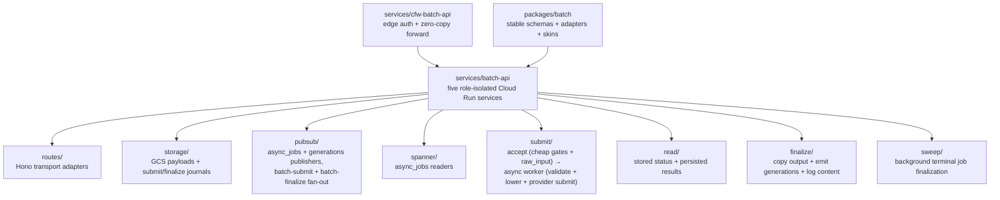

# batch-api

Cloud Run executors for OpenRouter Batch API. One image is deployed as five
role-isolated services. The Cloudflare ingress (`services/cfw-batch-api`)
authenticates and streams public requests to ingest or control; Pub/Sub and
Cloud Scheduler invoke the internal worker roles directly.

## Production Services

| Role     | Cloud Run service    | Caller and routes                                                                     | CPU / memory | Concurrency | Min / max | Timeout |
| -------- | -------------------- | ------------------------------------------------------------------------------------- | ------------ | ----------: | --------- | ------- |
| Ingest   | `batch-api`          | Cloudflare: `POST /api/v1/batches`                                                    | 2 / 4 GiB    |           1 | 1 / 200   | 15 min  |
| Submit   | `batch-api-submit`   | Pub/Sub: `POST /submit-job`                                                           | 4 / 8 GiB    |           1 | 0 / 50    | 60 min  |
| Finalize | `batch-api-finalize` | Pub/Sub: `POST /finalize-job`                                                         | 2 / 4 GiB    |           1 | 0 / 200   | 60 min  |
| Control  | `batch-api-control`  | Cloudflare: `GET /api/v1/batches` and `GET /api/v1/batches/:id`                       | 2 / 4 GiB    |          40 | 1 / 100   | 5 min   |
| Sweep    | `batch-api-sweep`    | Scheduler: `POST /sweep`                                                              | 1 / 2 GiB    |           1 | 0 / 1     | 15 min  |

`BATCH_SERVICE_ROLE` is required and Zod-validated at startup. Production
rejects the local-only `dev-all` role, and each production role mounts only its
route plus `/healthz`; unintended routes return 404. Cloud Run IAM is also
caller-specific: Cloudflare can invoke ingest/control, each Pub/Sub pusher can
invoke only its worker, and Scheduler can invoke only sweep.

The resource values are intentionally conservative starting points:

- Ingest handles up to 200 MB while doing SAX assembly, per-item validation and
  serialization, checksums, and resumable GCS upload on the event loop.
  Concurrency 1 prevents memory multiplication; 2 CPU/4 GiB gives checksum/GC
  headroom, and max 200 gives batch-launch headroom: slots are held by
  long-lived streaming creates, so the ceiling binds on concurrent uploads.
  Postgres ceiling at 200 instances is 200 x pool max 10 = 2000 connections.
- Submit is the heaviest stage: it rereads/parses up to 200 MB, runs
  moderation/lowering, writes artifacts, and uploads to the provider. One batch
  per 4 CPU/8 GiB instance avoids multiplying those allocations. Max 50 bounds
  provider and database pressure; these are profiling values, not final tuning.
- Finalize downloads and materializes potentially large results, then emits
  generation and billing records. One batch per 2 CPU/4 GiB instance keeps
  result streams/buffers from competing; max 200 sits just above observed
  arrivals, with the caveat that downstream GCS/Spanner/ClickHouse/provider
  bounds were sized against the prior ceiling of 25.
- Control requests combine small metadata reads with potentially large inline
  GCS result streams. The 4 GiB limit is temporary headroom after concurrent
  660–694 MB responses OOM-killed 2 GiB instances; concurrency remains 40 to
  preserve status-poll capacity while ECO-3419 measures stream memory and cost.
  The 5-minute timeout permits large streamed responses while bounding request
  lifetime.
- Sweep is I/O-heavy provider polling and fan-out. Concurrency/max 1 prevent
  overlapping full candidate scans; 15 minutes is comfortably above the normal
  poll duration without sharing status or worker slots.

These defaults respond to the 100-200 MB production scale run, where the shared
1 CPU/2 GiB service reached 99-100% CPU p99, instances exceeded their memory
limit, one-second health checks timed out, and killed workers dropped unrelated
workloads sharing the same process. The split is deliberately capacity
isolation first; load tests should tune each role independently after rollout.

All roles use a dedicated HTTP/1 health listener because the data listener is
h2c for 200 MB requests. Startup gets a 150-second window. Liveness uses a
3-second timeout and three 30-second periods, tolerating normal GC/event-loop
pauses before restart. Cloud Run does not expose a separate readiness-probe
primitive here; startup readiness and the platform concurrency queue prevent
traffic before the listener is ready. `/healthz` deliberately has no downstream
checks, avoiding restart storms during database/provider incidents.

### Isolation Gains

- Per-instance heavy-operation amplification falls from as many as eight 200 MB
  operations to one.
- Submit/finalize retries cannot consume ingest or control request slots, and
  upload CPU/GC pauses cannot fail worker or control health checks.
- Status and cancellation capacity remains available during scale tests.
- Every workload scales from its own request/queue pressure with an independent
  max-instance guardrail.
- Per-service Cloud Run metrics make RSS, CPU, event-loop lag, queue drain rate,
  and GCS throughput attributable to a role.
- A submit/finalize crash kills one batch execution rather than unrelated
  uploads or control requests sharing the instance.

This isolation does not replace moderation batching. Durable finalize dedupe
and renewable finalize leases land with the fenced finalize dispatch (a
generation-CAS claim plus a renewable execution lease in
`src/finalize/finalize-dispatch.ts` and the GCS `finalize_journal` store in
`src/finalize/finalize-job-journal.ts`).

## Runtime Layers



`batch-api` owns Cloud Run/runtime orchestration only. Public route contracts,
adapter contracts, provider adapters, and endpoint skins live in
`packages/batch`; edge auth/CORS/internal-token forwarding lives in
`services/cfw-batch-api`.

- `POST /api/v1/batches` — the accept half of submission. Incrementally
  stream-parses the JSON request body using the in-house `JSONSaxParser`
  (peak memory stays bounded to one item regardless of payload size), runs
  only the cheap synchronous gates — envelope metadata, endpoint/model
  resolution, request-count cap, `custom_id` uniqueness/constraints,
  affordability, admission — while streaming the verbatim payload to the
  `raw_input` GCS artifact, then records the job (`pending`, rendered as
  `validating`), publishes a `batch-submit` work message, and returns `202`.
  A 202 means "the payload is durably persisted and will be validated", not
  that the provider accepted the batch. Served over **h2c** (end-to-end
  HTTP/2) in prod so submits aren't capped by Google's front-end 32 MiB
  HTTP/1 body limit. Submit-phase timing and moderation latency are
  instrumented for the OOM/latency localization work.
- `POST /submit-job` — the async half, invoked per accepted batch by the
  `batch-submit` Pub/Sub push subscription. Replays the `raw_input` artifact
  through the full per-line pipeline (schema validation, line policy,
  per-line preflight plugins, chunk moderation, provider-wire lowering), streams
  the `input_file` + `input_file_lowered` artifacts to GCS, uploads/submits
  to the accept-time pinned endpoint/key, and advances the job to `in_progress`
  with its `provider_job_id`. A generation-CAS `submit_journal` object fences
  the provider call and stores uploaded file IDs/provider outcomes. Once an
  upload ID reaches the journal, redelivery reuses it; once submission starts,
  redelivery cannot issue another provider create call. Permanent failures
  mark the job `failed`; retryable pre-submit failures nack. Once the provider
  POST starts it is never repeated automatically. Ambiguous provider outcomes remain fenced for manual
  reconciliation rather than risking a duplicate upstream batch.
- `GET /api/v1/batches/:id` — reads batch status from Spanner (`async_jobs` row scoped to the caller's billable entity). Returns the batch object with status, request counts, and `finalized_at` derived from `updated_at` on terminal statuses. No upstream polling — reports stored status faithfully. Error results persisted at finalize (`batch_error_gcs_uri` on the row) are read back from GCS and rendered through the endpoint's skin contract on the serve path.
- `GET /api/v1/batches` — lists caller-scoped batch metadata newest first with
  `limit` + `after` cursor pagination and optional status/creation-time filters.
  List items always set `results` to `null`; this path reads only Spanner and
  never invokes the payment gate or GCS result storage.
- `POST /sweep` — Cloud Scheduler-driven sweep that reads in-flight jobs via
  the `async_jobs_sweep_v2` Spanner index, polls upstream status, and claims a
  generation-CAS `finalize_journal` before publishing terminal work. The same
  journal grants one finalize delivery renewable execution ownership. Each tick
  scans up to 1000 rows, filters active journals in GCS with bounded concurrency,
  and performs provider work for at most 200 eligible jobs so claimed rows do
  not starve newer candidates.
- `/healthz` returns `200`.
- Public routes use internal auth after the CF ingress authenticates the end
  user. Cloud Run IAM first validates the caller's Google OIDC identity. The
  ingress, submit pusher, finalize pusher, and scheduler service accounts can
  invoke only their corresponding role services.

## Responsibilities

- `POST /api/v1/batches`: stream-parse the request with the SAX parser, resolve
  a batch-capable endpoint, enforce the cheap per-line gates, estimate pending
  cost, persist the raw payload to GCS, emit the initial `async_jobs` row
  through Pub/Sub, publish the `batch-submit` work message, and return the
  public batch object (`status: "validating"`).
- `POST /submit-job`: replay the raw payload through per-line validation and
  preflights, persist the client-wire and provider-lowered JSONL artifacts,
  upload/submit to the provider, and advance the job to `in_progress` (or
  `failed` with a stored reason).
- `GET /api/v1/batches/:id`: read the caller-scoped `async_jobs` row from
  Spanner, map stored status to the public batch status, and inline persisted
  GCS results once terminal output exists.
- `GET /api/v1/batches`: scan caller-scoped `async_jobs` rows newest first,
  apply public status and creation-time filters, and return metadata-only pages.
- `/sweep`: read sweep candidates from Spanner and finalize terminal upstream
  jobs in the background.
- Finalize: poll upstream status, copy completed output to GCS, emit generation
  billing rows (BYOK usage is classified as `byok_usage_inference` and billed
  via an auth-service key lookup), upload generation log content, and publish
  the terminal `async_jobs` update.

## Module Layout

| Path                              | Purpose                                                                                                                                                                         |
| --------------------------------- | ------------------------------------------------------------------------------------------------------------------------------------------------------------------------------- |
| `src/app.ts`                      | Hono app composition and route mounting                                                                                                                                         |
| `src/routes/`                     | Thin HTTP adapters for health, batches, and sweep; converts use-case `ErrorT` values to responses                                                                               |
| `src/adapters/`                   | Runtime registry that wires provider names (OpenAI, Anthropic, Vertex Gemini) to batch adapters                                                                                 |
| `src/auth.ts`                     | Internal auth token verification from the edge worker                                                                                                                           |
| `src/auth/auth-service-client.ts` | Auth-service key-lookup client used by finalize to resolve BYOK billing context                                                                                                 |
| `src/submit/accept/`              | Accept use case (`submit-batch`): stream request consumer, raw-input persistence, cost estimate/affordability, admission limits, target/adapter resolution                      |
| `src/submit/worker/`              | Async submit worker (`execute-submit-job` + `scan-and-persist-batch-requests`): per-line preflights, provider lowering, generation-CAS submit journal, pinned target resolution |
| `src/submit/shared/`              | Helpers both submit halves use (custom ID validation, async item channel)                                                                                                       |
| `src/read/`                       | Stored batch reader, persisted GCS results reader, and per-job payment-fact access checks (`check-batch-results-access.ts`) that 402-gate results for unpaid jobs               |
| `src/finalize/`                   | Finalize use case, GCS dispatch/execution journal, result artifact persistence, generation billing/log content (fallback lines carry their own usage accounting)                 |
| `src/provider-keys/`              | Entity provider-key fetch and BYOK key resolution so batch jobs run against user-supplied provider credentials                                                                  |
| `src/storage/`                    | GCS URI/object-store helpers for `input_file` and `output_file`                                                                                                                 |
| `src/pubsub/`                     | Shared Pub/Sub publisher, async-job/generation submitters, batch-submit/finalize push envelopes                                                                                 |
| `src/spanner/`                    | Spanner readers for GET/finalize/sweep paths                                                                                                                                    |
| `src/routing/`                    | Batch endpoint resolution and route error adapter                                                                                                                               |
| `src/sweep/`                      | Background sweep orchestration and candidate reader                                                                                                                             |

## Shared Boundaries

- Import batch contracts through `@openrouter-monorepo/batch/schemas`,
  `@openrouter-monorepo/batch/adapters`, and `@openrouter-monorepo/batch/skins`.
  Only use the subpaths in the batch package's `package.json#exports`; do not
  deep-import other files from this service.
- Return `ErrorT` from use-case modules; only `src/routes/` should serialize
  HTTP error responses.
- Use the shared GCS URI builder in `src/storage/batch-gcs-store.ts`; do not
  hand-build `gs://.../input_file` or artifact strings.
- Use `createPubSubPublisher` for Pub/Sub REST publishes so metadata-token
  handling and response-body cancellation stay consistent.
- Use streaming helpers for large payload paths. The submit parser, GCS writes,
  result finalizer, and provider file upload must not collect full request or
  output bodies in memory.

## Remaining Work

- Results delivery for success output (error results are persisted at finalize and served via GET; success-output fetch/persist is the remaining piece)
- Cost hold storage on the Spanner `async_jobs` row
- Cloud Tasks / Pub/Sub finalizer (Cloud Scheduler sweep cron is in `infra/scheduler.tf`)
- Out of scope for v1: Temporal, webhooks, fallbacks/dynamic routing,
  cancellation, custom metadata, media/multimodal, per-row models, auctions

## Infra

`infra/` has its own Terraform state. Auth is Cloud Run IAM with a separate
policy per role. The CF ingress uses `batch-api-invoker` for ingest/control;
Pub/Sub uses `batch-submit-pusher` and `batch-finalize-pusher`; Scheduler uses
`batch-sweep-scheduler`. `invoker_iam_disabled = false`, so Cloud Run validates
the role-specific OIDC token and audience before a request reaches the app.

### Secret injection

Cloud Run containers don't read Infisical or KV directly. A secret value is
relayed across four layers before the app can read it from `process.env`:

```
Infisical /services/batch-api  →(sync)→  GSM BATCH_API_<KEY>  →(SA grant)→  container env (secret_key_ref)
```

1. **Value in Infisical** under `/services/batch-api` (prod) — the source of
   truth for the secret value.
2. **Infisical → GSM sync.** `infisical_secret_sync_gcp_secret_manager` in
   `secrets.tf` mirrors _every_ key in that folder into Google Secret Manager,
   renaming via `key_schema = "BATCH_API_{{secretKey}}"`. So Infisical
   `CF_KV_API_TOKEN` becomes GSM `BATCH_API_CF_KV_API_TOKEN`. This is
   folder-wide — there's no per-secret Terraform here.
3. **Read access.** The `batch-api-worker` SA holds
   `roles/secretmanager.secretAccessor` project-wide (`iam.tf`), so it can read
   every `BATCH_API_*` secret without a per-secret binding.
4. **Container wiring.** `cloudrun.tf` maps the GSM secret to a container env
   var via `value_source.secret_key_ref`. This is the only step that puts the
   value into the running container. `version = "latest"` resolves at revision
   creation, so a new revision must deploy after the secret exists or changes.

Non-secret config (bucket names, Spanner/PubSub IDs) is written as plain `value`
env in `cloudrun.tf` instead — Terraform is the write path for non-secret
config; Infisical only holds real secrets.

Adding a net-new secret is a workflow agents follow — see
[`infra/AGENTS.md`](./infra/AGENTS.md).

`bucket.tf` provisions the dev bucket (`openrouter-batch-api-dev`) where
`batch-api` keeps its own copy of every batch's input/output JSONL. As of the
customer-data cutover, prod writes go to `customer-data-batch-api-prod` in the
customer-data project; that bucket is adopted into this TF root via an
`import` block in `customer-data-bucket.tf` (it was created out-of-band by a
since-removed stack). The bucket name is passed as non-secret config. Objects
are keyed
`{billableEntityId}/{jobId}/{raw_input,input_file,input_file_lowered}` for input,
`{billableEntityId}/{jobId}/{submit_journal,finalize_journal}` for the small
generation-CAS state machines,
and
`{billableEntityId}/{jobId}/output/{raw_response,transformed}` for results —
finalize persists both the raw provider-native results and the transformed
client-format copy we serve. `raw_input` is deleted after the terminal submit
outcome is emitted; every object in these buckets auto-deletes 30 days after
creation via the GCS lifecycle rule in `bucket.tf` (OPE-5373), matching the
upstream batch retention window. The
`batch-api-worker` SA holds `roles/storage.objectAdmin` scoped to these buckets.

## Local Dev

Standalone uses the local-only all-routes role:

```bash
BATCH_SERVICE_ROLE=dev-all bun run dev   # http://localhost:8686
```

### Full Local Batch Stack (Tilt)

The batch path is two services: this Cloud Run service plus the
`services/cfw-batch-api` Cloudflare ingress. Tilt runs both:

- `gcp-batch-api` — this service, `bun run dev` on `BATCH_API_PORT` (default
  `8686`), healthy on `GET /healthz`.
- `cfw-batch-api` — the ingress on `CFW_BATCH_API_PORT` (default `8800`). Tilt
  points both role-specific upstream URLs at `http://127.0.0.1:8686`, where
  `gcp-batch-api` runs in `dev-all` mode.

Exercise the full ingress -> Cloud Run hop:

```bash
curl -i -X POST http://localhost:8800/api/beta/batches \
  -H 'content-type: application/json' \
  -d '{"endpoint":"/v1/chat/completions","model":"openai/gpt-4o","requests":[{"custom_id":"r1","body":{"model":"openai/gpt-4o","messages":[{"role":"user","content":"hi"}]}}]}'
```

The ingress mounts batch routes at `/api/beta/batches` during beta (reverts to
`/api/v1/batches` per OPE-5383); this service always serves `/api/v1/batches`.

### Dev Bucket Smoke Test

Use `fixtures/openai-batch-smoke.jsonl` to write a tiny provider-native input
file to the dev bucket using the same object ontology as the service. This
requires ADC or `GOOGLE_APPLICATION_CREDENTIALS` for a principal that can create
objects in `openrouter-batch-api-dev`.

```bash
cd services/batch-api

export BATCH_SMOKE_CLERK_ID="user_dev_smoke"
export BATCH_SMOKE_JOB_ID="batch_smoke_$(date +%s)"
export BATCH_SMOKE_URI="$(bun run --silent smoke:gcs:dev)"

gcloud storage cat "${BATCH_SMOKE_URI}"
gcloud storage rm "${BATCH_SMOKE_URI}"
```

To check that the same fixture is acceptable to OpenAI's Files API as batch
JSONL:

```bash
cd services/batch-api

curl https://api.openai.com/v1/files \
  -H "Authorization: Bearer ${OPENAI_API_KEY}" \
  -F purpose=batch \
  -F file=@fixtures/openai-batch-smoke.jsonl
```

## Deploy

Deploy manually via the `deploy-cloudrun-service.yaml` workflow
(`service-name: batch-api`). Infra is applied via
`apply-cloudrun-terraform.yaml`.

## Staging

A deployed, cost-optimized staging stack (`infra/staging.tf`) mirrors the prod
topology on real infrastructure so the full submit → sweep → finalize loop
(Pub/Sub push deliveries, Cloud Scheduler, OIDC auth, GCS artifacts) can be
exercised before a prod deploy:

- **One Cloud Run service** — `staging-batch-api` runs with
  `BATCH_SERVICE_ROLE=dev-all` and `OR_ENV=staging`, mounting every role's
  routes. `min_instance_count = 0` and request-based billing (`cpu_idle`)
  make an idle stack cost ~nothing.
- **Isolated fan-out and artifacts** — its own `batch-submit-staging` /
  `batch-finalize-staging` topics, push subscriptions, DLQs, the
  `openrouter-batch-api-staging` bucket, and a `batch-sweep-staging` cron.
  The staging deployment writes and reads only `job_type = batch_staging`
  rows (`src/batch-job-type.ts`, derived from `OR_ENV`), while prod uses
  `job_type = batch`, so the two sweep crons run unattended side by side
  without ever seeing each other's jobs in the shared Spanner table. The
  staging cron is created paused (the bootstrap revision runs the prod
  image, which may predate the job_type scoping); unpause it once after
  the first `STAGING-deploy`.
- **Shared data plane** — same `batch-api-worker` SA, GSM secrets, prod
  Spanner/Postgres, and the prod async-jobs topic (the dataflow pipeline
  behind it materializes the `async_jobs` rows sweep and status reads
  depend on). Staging tests must therefore target throwaway test entities
  only, mirroring the dataflow staging precedent.
- **Dead-end generation exhaust** — generation and ClickHouse records
  publish to `batch-generations-staging` / `batch-generations-clickhouse-staging`
  instead of the prod pipelines, so by default they expire unconsumed and
  staging runs leave no trace in prod generations or ClickHouse analytics.
  To exercise generation/billing logic on demand, dispatch
  `deploy-dataflow-staging.yaml` (pipeline: `generations`) with
  `extra_deploy_args: --source-topic=batch-generations-staging`
  plus a `--staging-tag` (e.g. `--staging-tag=batchex`, required so the
  job name can't collide with, and drain, an untagged staging run); the
  pipeline attaches an ephemeral subscription (topic retention lets it seek
  back over the last day with `--seek-back-secs`) and materializes records
  into the staging Spanner instance (`usage-record-staging`/`usage-staging`).
  Cancel the Dataflow job when done — nothing depends on it running.
  Note the split: the materialized `generations` rows land in the staging
  Spanner instance while the batch job's real `async_jobs` rows live in
  prod Spanner (isolated by job type), so cross-table joins between the
  two won't line up. The writer also settles charges per batch, and since
  it finds no matching job row in staging it inserts placeholder
  `async_jobs` rows there — expected noise in a throwaway database.

Deploys:

- Cloud Run: `deploy-staging-batch-api.yaml` (runs `STAGING-deploy`, updating
  only the staging service). Its job runs in the `staging` environment, which
  has no deployment branch policy, so pick your feature branch in "Use
  workflow from" and that branch is what gets built and deployed — push,
  dispatch, curl staging, iterate, merge only after it survives. The prod
  workflow (`deploy-cloudrun-service.yaml`) is unrelated and stays `main`-only
  via the `production` environment. Infra changes:
  `apply-cloudrun-terraform.yaml`
  (`service-name: batch-api` — staging lives in the same state).
- Bring-up order: the first Terraform apply must come after a prod
  `batch-api` deploy that contains the staging hostname binding
  (`src/index.ts`), because the service bootstraps from the prod image and
  an older image binds loopback under `OR_ENV=staging`, so the first
  revision would never pass its startup probe. Then run `STAGING-deploy`
  and unpause the sweep cron.

### Calling staging

There is deliberately no staging edge worker (no worker in the repo has a
named env; cfw-batch-api changes are validated by the local Tilt e2e stack
and prod gradual deploys). Call the staging Cloud Run service directly with
two headers:

1. **Cloud Run IAM** — an OIDC identity token;
   `group:engineering@openrouter.ai` holds `roles/run.invoker` on the
   service: `Authorization: Bearer $(gcloud auth print-identity-token)`.
2. **Application auth** — the internal-auth header the prod worker normally
   mints: `INTERNAL=$(bun run staging:token)` in this package signs a token
   for a throwaway test entity (`scripts/mint-staging-token.ts`, key pulled
   from the **dev** Infisical folder `/services/batch-api-staging` as
   `INTERNAL_AUTH_SIGNING_KEY`). Send it as
   `x-openrouter-internal-auth`. Override the identity with
   `BATCH_STAGING_ENTITY_ID` / `BATCH_STAGING_USER_ID`.

   Staging trusts its own signing key
   (`BATCH_API_STAGING_INTERNAL_AUTH_SIGNING_KEY` in GSM, mirrored from the
   dedicated dev Infisical folder by the staging sync in
   `infra/secrets.tf`), not the prod one, so staging tokens are
   cryptographically worthless against the prod services and holding the
   staging key is not a prod-grade credential. Living in the dev
   environment also means it can be provisioned and rotated without prod
   Infisical access.

Then hit the same routes the worker proxies (`POST /api/v1/batches`, etc.)
at the staging service URL. The rest of the loop (submit fan-out, sweep cron,
finalize, results in the staging bucket) runs unattended.

### Production rollout

1. Apply Terraform first. It preserves the existing `batch-api` resource as
   ingest and creates the four new services; the old image ignores the role env,
   so this step does not break existing public traffic.
2. Verify `/healthz` on all five services using an authorized identity and
   confirm Pub/Sub targets submit/finalize and Scheduler targets sweep with each
   service URL as its OIDC audience.
3. Deploy `cfw-batch-api` so root POST creation uses ingest and GET/future
   control paths use control. Canary one public create and get through the edge.
4. Deploy the `batch-api` image. The deploy command updates the same image digest
   across all five services, activating route enforcement together.
5. Confirm a submit push, sweep tick, finalize push, public create, and public
   get; then inspect per-role errors, CPU, memory, latency, instance counts, and
   queue drain rate.

Rollback reverses traffic before removing capacity: deploy the previous image
digest to all five services, restore the previous Cloudflare worker version so
all public traffic uses `batch-api`, then revert Pub/Sub/Scheduler targets if
needed. Keep the new services during rollback; remove them only in a later
Terraform apply after traffic and queues are confirmed drained. The Terraform
`moved` blocks preserve the original `batch-api` service and URL across the
singleton-to-role-map state transition.
