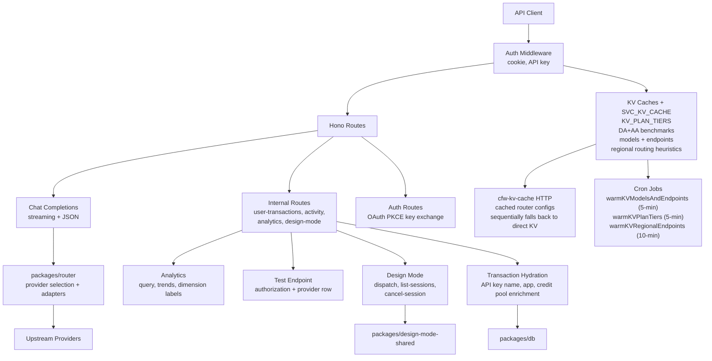

# OpenRouter Cloudflare Workers API

This service provides the edge API endpoints for OpenRouter using Cloudflare Workers.

## Getting Started

Start from the repository root using [local-dev-env](../../.agents/skills/local-dev-env/SKILL.md):

```bash
bun run dev:up
```

- The API defaults to `http://localhost:8787`; use Tilt's reported origin when ports differ.
- The worker's dev script generates `.dev.vars` from Infisical and local overrides.

## Architecture



## Development

- The service uses [Hono](https://hono.dev/) as the web framework
- API routes are defined in `src/routes/`
- Authentication middleware is in `src/auth.ts`

### Viewing traces locally

`wrangler dev` does not run tail consumers, so spans are dropped unless the local
trace pipeline is running. Press **enable telemetry** in Tilt, then open the
[Jaeger UI](http://localhost:16686) and select the `cfw-api` service. Set
`OTEL_DATADOG_EXPORT=1` to also export to Datadog APM. See
[`services/otel/README.md`](../otel/README.md#local-development).

### Performance Profiling and Flamegraphs

To capture flamegraphs and performance information for cfw-api, run `CFW_API_DEV_SKIP_ZOD_GUARDS_CHECK=1 bun run wrangler dev` from `services/cfw-api`, then press the letter "d" to bring up Chrome DevTools. The skip is refused when `CI` is set, so it cannot mask a stale artifact during deployment.

**Important:** The default command `bun run dev cfw-api` (run from the monorepo root) makes it impossible to launch the special-purpose DevTools located at <https://devtools.devprod.cloudflare.dev/> that you must have open in order to use the Chrome "Performance" tab.

**Steps:**
1. Navigate to the cfw-api directory: `cd services/cfw-api`
2. Run: `CFW_API_DEV_SKIP_ZOD_GUARDS_CHECK=1 bun run wrangler dev`
3. Press the letter "d" to open DevTools
4. Use the Performance tab to capture flamegraphs

**Note:** Do not use `chrome://inspect` - it will not work with Cloudflare Workers. You must use the DevTools opened by pressing "d".

### Bundle Analysis

To analyze the bundle size and understand what's included in your Worker bundle:

1. **Generate the bundle and metafile:**

   ```bash
   bun run cf:bundle
   ```

   Or with minification:

   ```bash
   bun run cf:bundle:min
   ```

   This will:
   - Build the bundle using the same process as `wrangler deploy` (via `--dry-run`)
   - Output the bundle to `./dist/`
   - Generate an esbuild metafile at `./bundle-meta.json`

2. **Analyze the bundle:**

   ```bash
   bun run cf:bundle:analyze
   ```

   This will open an interactive visualization of your bundle using `esbuild-visualizer` locally.

### Using zod performantly

If you are using Zod as a type guard on a hot path in cfw-api, you **must** use `buildZodGuard`.

**When am I on a hot path?**

You are on a hot path if the type guard is within cfw-api and run:
1. One or more times per chunk received from upstream. **All response transformation is a hot path**.
2. In a tight loop that could scale based on user input.

**How to use `buildZodGuard`:**

Call `buildZodGuard` on a Zod schema **at the module level**. Do not call `buildZodGuard` at runtime - since it's not possible to run `eval` at runtime, we will fall back to regular (slow) Zod validation.

```typescript
import { z } from 'zod';
import { buildZodGuard } from '@openrouter-monorepo/type-utils/zod';

const MoonshotCacheSchema = z.object({
  usage: z.object({
    cached_tokens: z.number(),
  }),
});

// Create the type guard at module level
const isMoonshotCache = buildZodGuard(MoonshotCacheSchema);

export class MoonshotAdapter extends EncodedImageOpenAIAdapter {
  public override readOpenAICacheReadTokensTotal(res: unknown): number {
    if (isMoonshotCache(res)) {
      return res.usage.cached_tokens;
    }
    return 0;
  }
}
```

In local profiling, using `isMoonshotCache(res)` instead of `parseSchema(MoonshotCacheSchema, res)` **saved approximately 1 second of CPU per 10,000 output tokens**.

**Limitations:**

`buildZodGuard` is not compatible with certain Zod features like `transform` and `preprocess`. These features require making copies of the validated object and should be avoided in hot paths anyway.

## Deployment

The service is automatically deployed to Cloudflare Workers when changes are pushed to the main branch.

To manually deploy:

```bash
bun run deploy cfw-api
```

## Commands

| Command | Description |
| --- | --- |
| `bun run dev` | Start the local Worker |
| `bun run test` | Run unit tests |
| `bun run test:integration` | Run integration tests |
| `bun run test:cron` | Trigger the local scheduled handler |
| `bun run typecheck` | Type-check with tsgo |
| `bun run submit` | Deploy to Cloudflare |
