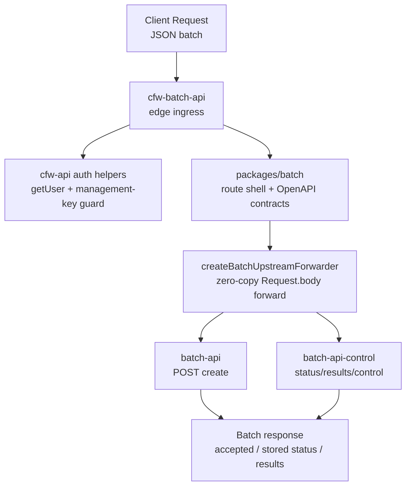

# CFW Batch API

Cloudflare Worker service for OpenRouter's Batch API. This is the thin
Cloudflare ingress that fronts the role-isolated `batch-api` Cloud Run services: it
authenticates the API key, applies WAF / DDoS / rate limits, mints the internal
auth token, and streams the request body straight through to the upstream
service.

This worker wires up auth, secrets, instrumentation, and routes requests to
`/api/beta/batches` paths for the Batch API. The deploy/dev plumbing is verified
and batch route forwarding is in place.

## Architecture



## Ownership Boundary

`cfw-batch-api` owns edge concerns only:

- authenticate the public API key via the shared `cfw-api` auth path
- reject provisioning keys that cannot run inference
- mint `X-OpenRouter-Internal-Auth` for the Cloud Run service
- attach Cloud Run OIDC auth in deployed environments
- preserve zero-copy streaming by forwarding `request.body` directly

It does not parse batch payloads, call providers, write GCS, publish Pub/Sub, or
read Spanner. Those responsibilities live in `services/batch-api`; shared
schemas/routes/adapters/skins live in `packages/batch`.

Successful `GET /api/beta/batches` collection responses are cached at the edge
for ten seconds by default. Entries preserve the complete query string and are
isolated by a SHA-256 digest derived from the caller's Authorization header and
authenticated entity/workspace scope; raw API keys and identity values are
never included in cache keys. Set `BATCH_LIST_EDGE_CACHE_TTL_SECONDS` to an integer
from 1 through 60, or set it to `0` to disable caching. Clients receive
`Cache-Control: private`; errors, submits, and individual batch reads are never cached.

## Key Modules

| Path                      | Purpose                                                     |
| ------------------------- | ----------------------------------------------------------- |
| `src/index.ts`            | Worker entry point (instrumentation + statsd)               |
| `src/app.ts`              | Hono app setup, auth middleware, `packages/batch` app mount |
| `src/upstream.ts`         | Header scrubber + zero-copy Cloud Run forwarder             |
| `src/middlewares/auth.ts` | End-user auth and internal auth token minting               |
| `src/middlewares/env.ts`  | Environment validation and cached upstream forwarder        |
| `src/routes/`             | Worker-local routes (currently `health`)                    |
| `src/env.ts`              | Worker environment bindings + `ensureEnv`                   |

## Local dev

This worker is the ingress half of the batch stack; the other half is the
`services/batch-api` Cloud Run service. Run the full stack under Tilt:

- `gcp-batch-api` — the upstream Cloud Run service (`services/batch-api`) on
  port `8686`, healthy on `GET /healthz`.
- `cfw-batch-api` — this ingress on `CFW_BATCH_API_PORT` (default `8800`).

By default `wrangler.toml` points `BATCH_API_INGEST_URL` and
`BATCH_API_CONTROL_URL` at their production Cloud Run services. Root POST
creation goes to ingest; all other public operations go to control. For local
dev Tilt overrides both with `http://127.0.0.1:8686`, where the Cloud Run app
runs in production-rejected `dev-all` mode. No prod URL or GCP creds are
required. When running this worker on
its own (`bunx wrangler dev`), `cp .dev.vars.example .dev.vars` to get the
same override (see [.dev.vars.example](./.dev.vars.example)).

Exercise the full ingress -> Cloud Run hop:

```bash
curl -i -X POST http://localhost:8800/api/beta/batches \
  -H 'content-type: application/json' -d '{}'
```

> Routes are mounted at `/api/beta/batches` during beta (reverts to
> `/api/v1/batches` per OPE-5383).

## Commands

| Command              | Description                      |
| -------------------- | -------------------------------- |
| `bun run dev`        | Start local development server   |
| `bun run test`       | Run unit tests                   |
| `bun run test:watch` | Run tests in watch mode (vitest) |
| `bun run submit`     | Deploy to Cloudflare             |
| `bun run typecheck`  | Type-check with tsgo             |
| `bun run cf:bundle`  | Dry-run deploy to inspect bundle |
