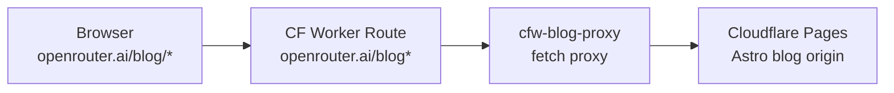

# cfw-blog-proxy

Lightweight Cloudflare Worker that proxies `openrouter.ai/blog*` requests to the Astro blog hosted on Cloudflare Pages. Follows the same pattern as `cfw-docs-proxy` for path-prefix routing.

## Architecture

## How It Works

The worker intercepts all requests matching `openrouter.ai/blog*`, rewrites the URL to the Cloudflare Pages origin (`PAGES_ORIGIN` env var), and forwards the request. Path and query string are preserved.

## Commands

| Command | Description |
|---------|-------------|
| `bun run dev` | Start local dev server |
| `bun run start` | Start with wrangler dev |
| `bun run submit` | Deploy to Cloudflare |
| `bun run typecheck` | Type-check with tsgo |
