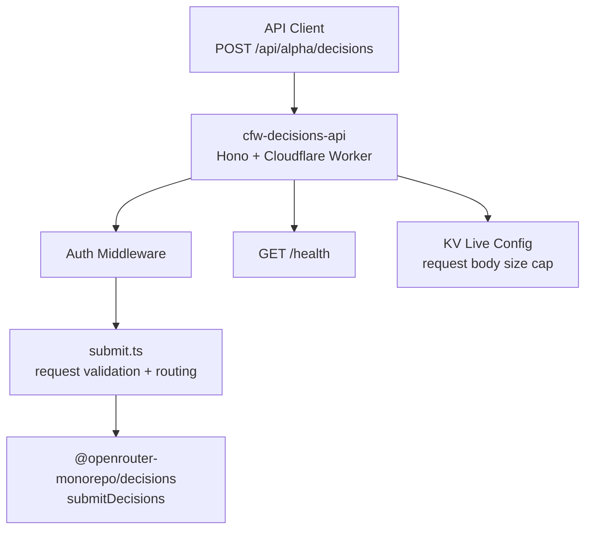

# cfw-decisions-api

Cloudflare Worker serving OpenRouter's `/api/alpha/decisions` endpoint. Handles authentication, request validation, and delegates to the `packages/decisions` engine for provider-agnostic Decisions requests.

## Architecture

## Key Modules

| Path | Purpose |
|------|---------|
| `src/index.ts` | Worker entrypoint — Hono app with Datadog instrumentation |
| `src/app.ts` | Hono app setup and route registration |
| `src/routes/decisions/submit.ts` | Decisions submission handler with Zod validation and routing |
| `src/routes/health.ts` | Health check endpoint |
| `src/live-config.ts` | KV-backed runtime config for the request body size cap |
| `../../packages/cloudflare/hono/content-length-cap.ts` | Shared `Content-Length` cap check backing the 413 middleware on the submit route |

## Commands

| Command | Description |
|---------|-------------|
| `bun run dev` | Start local dev server (wrangler) |
| `bun run test` | Run tests |
| `bun run submit` | Deploy to Cloudflare |
| `tsgo --noEmit` | Type-check |
