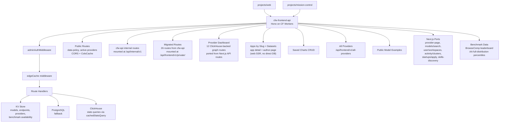

# cfw-frontend-api

Cloudflare Worker that serves frontend data to `projects/web` and `projects/mission-control`. Reads from KV caches warmed by `cfw-api` and falls back to the database when KV is empty or unavailable. Most routes sit behind admin auth and edge caching middleware; public routes (e.g. `/api/frontend/v1/data-policy`, `/api/frontend/v1/all-providers`) use CORS middleware instead. Also hosts ClickHouse-backed stats routes for mission-control analytics dashboards.

## Architecture

## Routes

| Path | Purpose |
|------|---------|
| `/api/frontend/v1/apps/list` | Apps list for org dashboards |
| `/api/frontend/v1/apps/marketplace` | Apps marketplace datasets (per-dataset handlers: marketplace, category, app, app-rankings, ...) |
| `/api/frontend/v1/author-models` | Models authored by a specific provider |
| `/api/frontend/v1/author-page` | Author profile page data for the web author route (replaces the direct DB connection during SSR) |
| `/api/frontend/v1/catalog/endpoint` | Endpoint catalog entry |
| `/api/frontend/v1/catalog/models` | Public model catalog (paginated, filterable) |
| `/api/frontend/v1/catalog/providers` | Provider catalog entries |
| `/api/frontend/v1/data-policy` | Data policies (ColoCache, public) |
| `/api/frontend/v1/endpoints` | Global endpoints cache (KV-backed, sanitized) |
| `/api/frontend/v1/image-proxy` | Proxied image fetching for model thumbnails |
| `/api/frontend/v1/llms-full-txt-proxy` | LLMs.txt full proxy endpoint |
| `/api/frontend/v1/models` | Global models cache (KV-backed, DB fallback) |
| `/api/frontend/v1/models/find` | Model search with analytics enrichment |
| `/api/frontend/v1/provider-filters` | Provider filter options for marketplace UI |
| `/api/frontend/v1/providers` | Global providers cache (KV-backed, sanitized) |
| `/api/frontend/v1/sdk-providers/catalog` | SDK provider catalog for rankings and mission-control |
| `/api/frontend/v1/spawn-manifest` | Spawn manifest for worker orchestration |
| `/api/frontend/v1/flag-checks` | Terminal ingest for the web app's first-party flag-check reporter — bounded anonymous (flag, value) counts land in ClickHouse; nothing involves Statsig |
| `/api/frontend/v1/benchmarks/has-benchmarks` | KV-backed benchmark availability check (`{ hasBenchmarks: boolean }`) via in-memory Set lookup; edge-cached 60s/300s |
| `/api/frontend/v1/all-providers` | Active providers with optional filtering (status, name) |
| `/api/frontend/v1/stats/effective-pricing` | Effective pricing analytics |
| `/api/frontend/v1/stats/endpoint` | Per-endpoint statistics |
| `/api/frontend/v1/stats/latency-comparison` | Latency comparison across providers |
| `/api/frontend/v1/stats/latency-e2e-comparison` | End-to-end latency comparison |
| `/api/frontend/v1/stats/model-activity` | Model activity metrics |
| `/api/frontend/v1/stats/model-uptime-recent` | Recent model uptime snapshots |
| `/api/frontend/v1/stats/router-activity` | Router-level activity metrics |
| `/api/frontend/v1/stats/structured-output-error-rate` | Structured output failure rates |
| `/api/frontend/v1/stats/tau2-airline-leaderboard` | τ²-Bench airline leaderboard page data |
| `/api/frontend/v1/stats/throughput-comparison` | Throughput comparison analytics |
| `/api/frontend/v1/stats/tool-call-error-rate` | Tool call failure rates |
| `/api/frontend/v1/stats/top-apps-for-model` | Top consuming apps per model |
| `/api/frontend/v1/stats/top-colos-for-model` | Top Cloudflare colos per model |
| `/api/frontend/v1/stats/uptime-comparison` | Uptime comparison across providers |
| `/api/frontend/v1/stats/uptime-hourly` | Hourly uptime breakdown |
| `/api/frontend/v1/stats/uptime-recent` | Recent uptime snapshots |
| `/api/frontend/v1/private/guardrails` | Guardrails CRUD (ported from cfw-api) |
| `/api/frontend/v1/private/guardrail-analytics` | Guardrail analytics (ported from cfw-api) |
| `/api/frontend/v1/analytics-query` | Analytics query (ported from cfw-api) |
| `/api/frontend/v1/analytics-trends-section` | Analytics trends section (ported from cfw-api) |
| `/api/frontend/v1/transaction-analytics` | Transaction analytics (ported from cfw-api) |
| `/api/frontend/v1/user-transactions` | User transactions (ported from cfw-api) |
| `/api/frontend/v1/apps` | App detail lookups (ported from cfw-api) |
| `/api/frontend/v1/user-api-keys` | User API key management (ported from cfw-api) |
| `/api/frontend/v1/stats/uptime-recent-private` | Private recent uptime snapshots (ported from cfw-api) |
| `/api/frontend/v1/stats/provider-token-chart` | Provider token chart analytics |
| `/api/frontend/v1/rankings/:dataset` | Rankings/benchmark data by dataset (18+ dataset handlers via ClickHouse) |
| `/api/frontend/v1/private/user/stats-from-usage-record` | User stats aggregated from usage records |
| `/api/frontend/v1/private/stats/uptime-hourly-private` | Private hourly uptime breakdown |
| `/api/frontend/v1/private/organization/users-with-stats-from-usage-record` | Org member stats from usage records |
| `/api/frontend/v1/private/models` | Private models data |
| `/api/frontend/v1/private/provider-dashboard/*` | Provider dashboard routes (aggregate stats, benchmark scores, benchmark comparison, model error rates, monthly report, list endpoints, test runs, latency/throughput/colo-request/tool-call/structured-output graphs, plus provider-info, get-endpoint, endpoint capabilities/visibility duplicated from cfw-api) — ported from Next.js API routes to ClickHouse-backed CF Worker routes |
| `/api/frontend/v1/private/generations-feedback` | Generation feedback submission (cookie-authed, ported from a Next.js server action) |
| `/api/frontend/v1/provider-page/:slug` | Provider-page models for the provider profile UI (ported from Next.js) |
| `/api/frontend/v1/models/search` | Model search with name-mapping (ported from Next.js) |
| `/api/frontend/v1/skills-discovery` | Public skills index for skill discovery (ported from Next.js) |
| `/.well-known/skills/index.json` | Well-known mount of the same skills-discovery handler |
| `/api/frontend/v1/private/user/workspaces` | User workspaces (ported from Next.js) |
| `/api/frontend/v1/private/activity/clusters` | Activity cluster dashboard (ported from Next.js) |
| `/api/frontend/v1/private/startups/apply` | Startup-program application submission (ported from Next.js) |
| `/api/frontend/v1/private/startups/apply/upload-urls` | Signed upload URLs for startup-application materials (ported from Next.js) |

## Key Directories

| Path | Purpose |
|------|---------|
| `src/routes/` | Route handlers organized by domain (models, endpoints, providers, stats, etc.) |
| `src/routes/provider-dashboard/` | Provider-dashboard routes: 12 graph routes ported from Next.js API routes (aggregate stats, benchmark scores/comparison, model error rates, monthly report, list endpoints, test runs, latency/throughput/colo-request graphs) plus provider-info, get-endpoint, and endpoint capability/visibility management routes duplicated from cfw-api (with a shared endpoint test runner in `helpers/`) |
| `src/routes/stats/` | ClickHouse-backed analytics routes for mission-control dashboards |
| `src/routes/apps-marketplace/` | Apps marketplace dataset routes (per-dataset handlers via cachedStatsQuery) |
| `src/kv/` | KV cache readers with FetchDeduper wrappers; includes `web-endpoints-cache.ts` and `benchmark-cache.ts` for KV-backed benchmark availability (5-min TTL + SWR) |
| `src/middlewares/` | Env injection, edge cache, auth middleware |
| `src/db/` | DB context initialization for fallback queries |

## Commands

| Command | Description |
|---------|-------------|
| `bun run dev` | Start local dev server |
| `bun run start` | Start with wrangler dev |
| `bun run submit` | Deploy to Cloudflare |
| `bun test` | Run unit tests |
