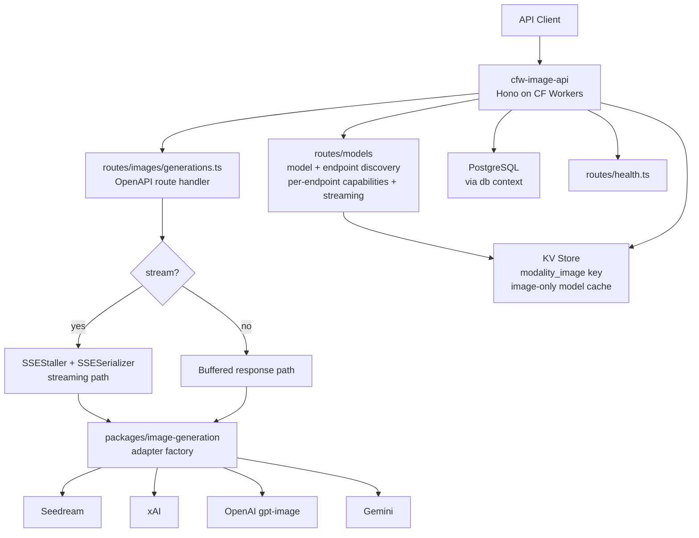

# cfw-image-api

Cloudflare Worker that serves the OpenRouter image generation API. Receives image creation requests, dispatches to provider adapters via `packages/image-generation`, and returns generated images. The request lifecycle stays worker-local because its response conversion and billing use worker bindings.

## Architecture

## Key Files

| Path | Purpose |
|------|---------|
| `src/app.ts` | Hono app setup with contextStorage and DB middleware |
| `src/routes/images/generations.ts` | HTTP admission, request parsing, and lifecycle construction for `/api/v1/images`; rejects oversized request bodies before parsing |
| `src/routes/images/lifecycle/context.ts` | Request facts and model, routing, and invocation value types |
| `src/routes/images/lifecycle/capabilities.ts` | Request-scoped recording, rate limiting, and app attribution |
| `src/routes/images/lifecycle/submit.ts` | Linear request orchestration and the final error-response boundary |
| `src/routes/images/lifecycle/resolve.ts` | Model/candidate resolution, routing, and conditional upfront authorization |
| `src/routes/images/lifecycle/definition.ts` | Executable feature catalog and ordered request/model/endpoint guards |
| `src/routes/images/lifecycle/guards.ts` | Request and endpoint guard implementations |
| `src/routes/images/lifecycle/invoke.ts` | One buffered or streaming provider attempt |
| `src/routes/images/lifecycle/finalize.ts` | Buffered/SSE response construction, billing tails, and exhaustion handling |
| `src/routes/images/lifecycle/errors.ts` | Image-specific error-response conversion |
| `src/routes/models/index.ts` | Model discovery — `GET /api/v1/images/models` (listing with top-level `supported_parameters` superset and `supports_streaming` flag) and `GET /api/v1/images/models/{author}/{slug}/endpoints` (definitive per-endpoint capabilities + `pricing`) |
| `src/routes/models/to-image-endpoints.ts` | Builds per-endpoint records: capabilities from the adapter capability schema, `pricing[]` from the endpoint pricing strategy, `supports_streaming` from adapter prototype detection |
| `src/routes/health.ts` | Health check endpoint |
| `src/db/context.ts` | Database context initialization |
| `src/kv.ts` | Image-specific router config cache via `KV_MODALITY_IMAGE` key with FetchDeduper (5-min TTL) |
| `src/env.ts` | Worker environment bindings |
| `src/utils/image-generation-billing.ts` | Billing utilities: transaction initialization (`initImageGenerationTx`), ClickHouse conversion, and usage computation |
| `src/utils/image-generation-finalize.ts` | Unified billing/observability sequence shared by buffered and streaming paths — `finalizeImageGenerationBilling` handles both with a `didComplete` flag to classify truncated streams |
| `@openrouter-monorepo/cloudflare/hono/content-length-cap` | Shared content-length request-size cap (413 response) guarding worker memory before upstream dispatch |
| `src/utils/is-content-moderated-error.ts` | Detects provider content-moderation refusals so they are classified separately from infrastructure failures in dashboard success rates |
| `src/utils/image-generation-log-tx-attempt.ts` | Transaction-attempt logging with outcome classification (success, moderation refusal, provider error) |

## Lifecycle Catalog

[`src/routes/images/lifecycle/definition.ts`](src/routes/images/lifecycle/definition.ts) binds the existing image-specific authorization, guards, routing, and reporting functions. It does not replace image's conditional upfront/per-endpoint authorization with the synchronous-modality billing object. Region enforcement stays after routing and provider filtering.

Usage recording and broadcast delegate to one response-tail reporter, preserving shared text-only payload construction and existing enablement/privacy gates. In-flight reservation support is recorded as missing, referencing the canceled, not-planned [ECO-3726](https://linear.app/openrouter/issue/ECO-3726); no reservation behavior is added.

## Commands

- `bun run dev` — Start local dev server.
- `bun run start` — Start with wrangler dev.
- `bun run submit` — Deploy to Cloudflare.
- `bun test` — Run unit tests.
