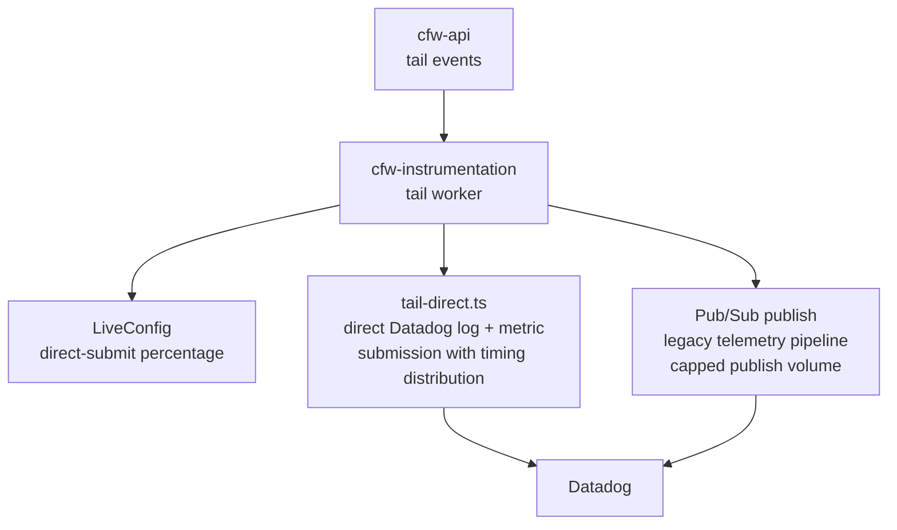

# cfw-instrumentation

The [cfw-api](../cfw-api/README.md) service is a "producer" worker. It produces events, metrics, and logs when executing our core business logic.

That data is then consumed by the instrumentation worker here. Errors and application metrics are forwarded to Datadog; both logs and metrics default to direct Datadog API submission, with the legacy queue/Pub/Sub telemetry pipeline as fallback.

This has the benefit of cleanly separating responsibility, and also eliminates the possibility of concurrent request saturation in an edge worker (see [limits described here](https://developers.cloudflare.com/workers/platform/limits/#simultaneous-open-connections)).

## Architecture



Delivery is split between direct Datadog submission (`src/tail-direct.ts` and `src/datadog-metrics.ts`, rolled out via LiveConfig-tunable percentages that now default to direct) and the legacy Pub/Sub telemetry pipeline, whose publish volume is capped.

## Bundle Analysis

To analyze the bundle size and understand what's included in your Worker bundle:

1. **Generate the bundle and metafile:**

   ```bash
   bun run cf:bundle
   ```

   Or with minification:

   ```bash
   bun run cf:bundle:min
   ```

   This will:
   - Build the bundle using the same process as `wrangler deploy` (via `--dry-run`)
   - Output the bundle to `./dist/`
   - Generate an esbuild metafile at `./bundle-meta.json`

2. **Analyze the bundle:**

   ```bash
   bun run cf:bundle:analyze
   ```

   This will open an interactive visualization of your bundle using `esbuild-visualizer` locally.
