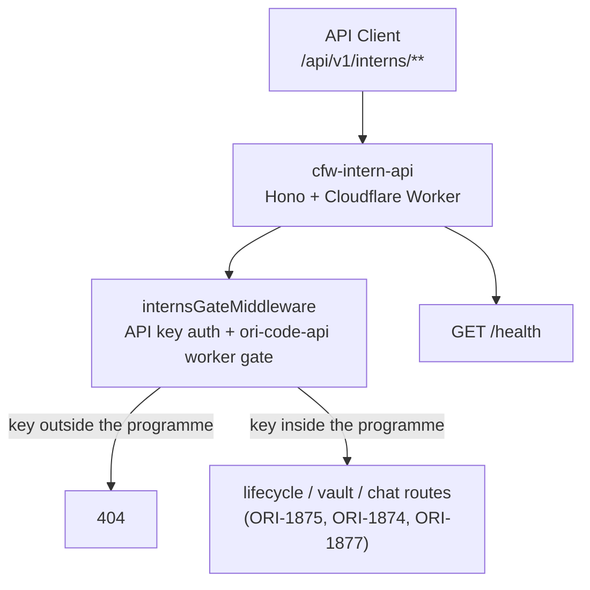

# cfw-intern-api

Cloudflare Worker serving OpenRouter's `/api/v1/interns/**` and `/api/v1/vault/**` endpoints with API-key auth. It sits alongside `cfw-intern-provisioner` and `cfw-secret-vault`.

## Architecture



## Key Modules

| Path | Purpose |
|------|---------|
| `src/index.ts` | Worker entrypoint with Datadog instrumentation |
| `src/app.ts` | Hono app setup, error handler and route registration |
| `src/routes/interns/index.ts` | The `/api/v1/interns` sub-app every intern route registers on |
| `src/routes/interns/interns-gate.ts` | Resolves the caller's Statsig identity from its API key and evaluates the `ori-code-api` gate once per request |
| `src/routes/interns/types.ts` | Caller and identity types shared by the gate and the routes |
| `src/routes/interns/chat/route.ts` | `POST /:internId/chat/completions`: admission, request reading, daemon invocation and the SSE response |
| `src/routes/interns/chat/daemon-transport.ts` | Invokes the intern's daemon with `detachOnInteraction`, delivers native interaction responses and attaches to the same run |
| `src/routes/interns/chat/daemon-stream-projector.ts` | Projects daemon runtime events onto OpenAI-compatible chat completion chunks, tool calls and streamed errors |
| `src/routes/interns/chat/openapi.ts` | Public OpenAPI metadata for the chat route, registered on the interns sub-app and assembled into the public spec |
| `src/routes/vault/index.ts` | Seven customer vault routes behind the intern gate |
| `src/routes/vault/workspace-scope.ts` | Primary database checks for the API key's workspace and optional intern |
| `src/vault-client/vault-client.ts` | Private service client with strict metadata responses and bounded requests |
| `src/routes/health.ts` | Health check endpoint |

## Ingress

`wrangler.toml` declares the existing intern routes and the vault routes. Specific provisioner routes retain precedence over the intern wildcard. `workers_dev = false` keeps the worker off `workers.dev`. Vault requests on `eu.openrouter.ai` and `us.openrouter.ai` receive a regional residency refusal before authentication.

## Customer vault scope

Each API key accesses only its resolved workspace UUID: the key's explicit `workspace_id`, else the entity's default workspace, the same value `GET /api/v1/key` reports. Workspace ownership is checked on the primary database against the key's user or organization, so a resolved default that has no live workspace row is refused with `scope_unavailable`. Intern routes also require that intern to belong to the same workspace and entity.

The private vault receives the UUID in `x-vault-workspace-id` and the trusted entity in `x-vault-entity-id`. Caller-supplied versions of these headers are ignored. Configure `SECRET_VAULT_URL` and `SECRET_VAULT_API_KEY` through the service's secret mapping. Missing configuration returns 503 from vault routes. Responses contain metadata only and use `Cache-Control: no-store`.

## Running it locally

`intern-api` is a Tilt resource in the `apis` group beside `frontend-api` and `public-api`, so it starts on **every** `tilt up` with no flag. It is not part of the `--interns` stack: that flag switches the local intern runtime and the vault half on, and this worker is up either way. Its three declared deps (`postgres-seed`, `api-kv-cron`, `worker-gates-seed`) are ungated too, so nothing holds it back and no `tilt trigger` is needed.

It listens on `CFW_INTERN_API_PORT`, default `8823`. `bun run dev:ports on` remaps it into the worktree's port block by writing `.env.worktree`, which Tilt reads and your shell does not, so source that file first or the smoke below hits the default port.

```sh
[ ! -f .env.worktree ] || . ./.env.worktree
PORT=${CFW_INTERN_API_PORT:-8823}
curl -s localhost:$PORT/health                                            # 200 ok
curl -s -o /dev/null -w '%{http_code}\n' localhost:$PORT/api/v1/interns   # 401, no key
curl -s -o /dev/null -w '%{http_code}\n' localhost:$PORT/no-such-path     # 404
```

With a key, the gate decides what comes next; see [`AGENTS.md`](./AGENTS.md) for the order it evaluates in. The interns sub-app serves the chat completion route (ORI-1877); every other path under the prefix still ends at the catch-all 404 until ORI-1875 lands the lifecycle routes, so the API does not yet create, list or read interns. The customer contract for the chat route, including the two-request interaction flow, is in [`projects/docs/guides/ori/intern-chat.mdx`](../../projects/docs/guides/ori/intern-chat.mdx). Running it locally needs the intern runtime from `tilt up -- --interns`.

Seeded rows are the way to land in a lifecycle state: `bun run db:reset` runs `scripts/seed/seed-interns.ts`, documented in [`cfw-intern-provisioner/AGENTS.md`](../cfw-intern-provisioner/AGENTS.md#seeding-states). The API is an extra check beside that seed, not a replacement for it.

## Commands

| Command | Description |
|---------|-------------|
| `bun run dev` | Start local dev server (wrangler, Infisical secrets) |
| `bun run test` | Run tests |
| `bun run test:cfw` | Run `*.cfw.test.ts` in workerd (vault client transport against loopback stubs) |
| `bun run submit` | Deploy to Cloudflare |
| `tsgo --noEmit` | Type-check |
