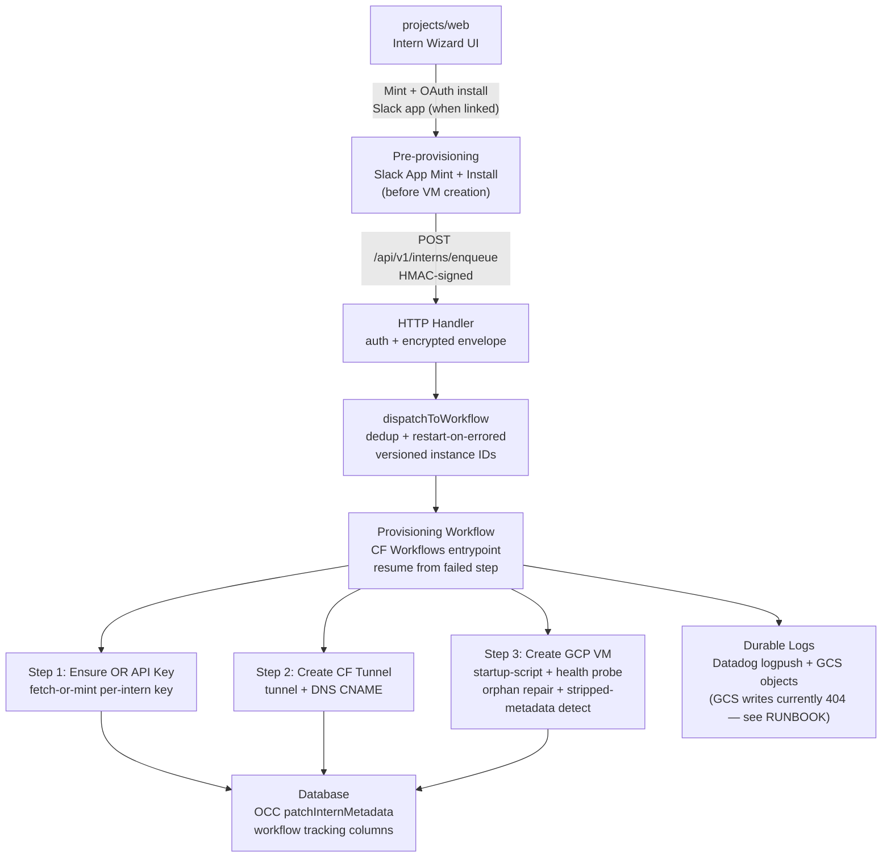

# cfw-intern-provisioner

Cloudflare Worker that automates the provisioning of OpenRouter intern development environments. Receives provisioning requests via the authenticated `POST /api/v1/interns/enqueue` HTTP endpoint, dispatches a Cloudflare Workflow that creates cloud resources (an OpenRouter API key, a Cloudflare tunnel, a GCP VM), and tracks progress in the database for dashboard visibility. A matching destroy Workflow tears all of it back down.

Slack is optional per intern. When an intern links a Slack workspace, the per-intern Slack app is minted and OAuth-installed by the **web tier before** enqueue, not by this Workflow — see `RUNBOOK.md`.

The worker is attached to the shared `openrouter.ai` zone via Cloudflare Routes — same path-routing convention used by `cfw-api`. No dedicated subdomain. It shares the `/api/v1/interns` prefix with `cfw-intern-api`, which serves the customer-facing API-key routes on the `openrouter.ai/api/v1/interns/*` wildcard. Cloudflare hands a request to the most specific matching route, so every operational path this worker serves (`/health`, `/vm-report`, `/logs`, `/enqueue`, `/deprovision`, `/archive-now`, `/instructions`, `/mcp-servers`, `/runtime-image`, `/runtime-image/current`, and any path later added to `src/http/post-routes.ts` or `src/index.ts`) needs its own exact route on this worker, attached before the wildcard moves to `cfw-intern-api`. A path missing from that list lands on `cfw-intern-api` and fails its API-key auth with 401.

## Architecture

## Key Modules

| Path | Purpose |
|------|---------|
| `src/index.ts` | Worker entrypoint — HTTP routes (`health`, `enqueue`, `deprovision`, the three `runtime-image` routes) and the Workflow dispatchers |
| `src/workflow.ts` | `InternProvisioningWorkflow` — durable state machine orchestrating all steps with resume-from-failed-step support |
| `src/destroy-workflow.ts` | `InternDestroyWorkflow` — the teardown counterpart, fenced against a live provisioning run |
| `src/run-provisioning-step.ts` | Wrapper around `step.do` that stamps status + progress before execution |
| `src/steps/` | Provisioning steps (`ensure-openrouter-api-key`, `create-cf-tunnel`, `create-gcp-vm`), the `destroy/` step set, plus pure helpers (`health-probe`, `vm-metadata`, `vm-liveness`, `step-resume`) |
| `src/clients/` | Provider HTTP clients (GCP Compute, GCS, Cloudflare API, Slack) and the VM startup-script builders (`gcp-startup-script-*`) |
| `src/runtime-image/` | Resolving and swapping an intern's ori runtime image |
| `src/vm-desired-state/mcp-servers/` | MCP server-list metadata: the `/mcp-servers` entity push, and the five-minute reconcile that restamps running interns whose metadata drifted from the current derivation (see `RUNBOOK.md`) |
| `src/queries/interns.ts` | Database queries for intern status, credential persistence, and OCC metadata patching |
| `src/env.ts` | Environment bindings and `InternProvisioningMessage` schema |

## Commands

| Command | Description |
|---------|-------------|
| `bun run dev` | Start local dev server (wrangler) |
| `bun run submit` | Deploy to Cloudflare |
| `bun run test` | Run unit tests |
| `tsgo --noEmit` | Type-check |
