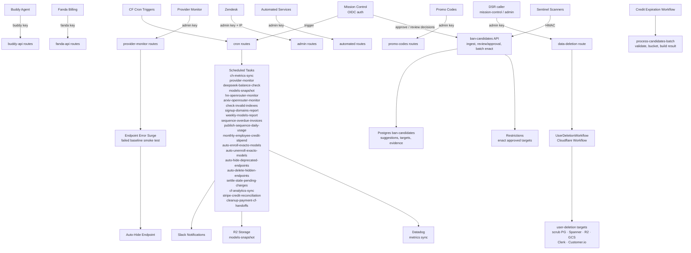

# cfw-internal

Internal Cloudflare Worker serving admin-key-gated API endpoints for service-to-service communication between OpenRouter services (including projects/web, projects/mission-control, and automated services). It owns the sole user-deletion path through `UserDeletionWorkflow` and the cron monitor sweep; the former GCP Graphile orchestrator has been removed. It also runs scheduled tasks previously hosted on Vercel.

## Architecture

## Key Modules

| Path                                                     | Purpose                                                                                                                                                                                                                                                  |
| -------------------------------------------------------- | -------------------------------------------------------------------------------------------------------------------------------------------------------------------------------------------------------------------------------------------------------- |
| `src/routes/`                                            | Route handlers (buddy-api, fanda-api, cron, provider-monitor, admin, automated, promo-codes, skills dashboard API)                                                                                                                                       |
| `src/routes/buddy-api/`                                  | Buddy agent CRUD for models/endpoints/pricing versions — reads include hidden entities, and all mutation routes go through a safe-by-default apply layer (`apply-preview.ts`) that previews changes before applying. Model/endpoint responses expose a normalized `reasoning_config` (via `packages/models` `parseModelReasoningConfig`) with schema nullability aligned to the DB row |
| `src/routes/ban-candidates/`                            | Sentinel ban-candidate ingest, a review/approval endpoint for candidate targets, and batch-enact (`enact.ts` / `enact-target.ts`) that turns approved candidates into `packages/db` restrictions |
| `src/routes/skills/`                                     | Internal skills dashboard API (relocated from web) — CRUD, delete, version management                                                                                                                                                                    |
| `src/routes/cron/tasks.ts`                               | `CronTask` enum and `executeCronTask` dispatcher for all scheduled jobs. All tasks are manually triggerable via `POST /api/v1/internal/cron/trigger` (CRON_SECRET or OIDC auth)                                                                          |
| `src/routes/cron/monthly-employee-credit-stipend.ts`     | Monthly employee credit stipend cron task                                                                                                                                                                                                                |
| `src/routes/cron/models-snapshot/`                       | Hourly model catalog diff with R2 storage and Slack alerts                                                                                                                                                                                               |
| `src/routes/cron/weekly-models-report.ts`                | Weekly model catalog diff report (pricing changes, new/removed models) posted to Slack                                                                                                                                                                   |
| `src/routes/cron/arxiv-openrouter-monitor/`              | Daily arXiv paper monitor with LLM summarization                                                                                                                                                                                                         |
| `src/routes/cron/hn-openrouter-monitor.ts`               | Daily Hacker News mention scraper                                                                                                                                                                                                                        |
| `src/routes/cron/deepseek-balance-check.ts`              | Daily DeepSeek API balance alert                                                                                                                                                                                                                         |
| `src/routes/cron/ch-metrics-sync.ts`                     | ClickHouse-to-Datadog metrics pipeline                                                                                                                                                                                                                   |
| `src/routes/cron/sequence-overdue-invoices.ts`           | Daily overdue invoice check via Sequence API (migrated from Vercel)                                                                                                                                                                                      |
| `src/routes/cron/publish-sequence-daily-usage-events.ts` | Daily usage event publishing to Sequence (migrated from Vercel)                                                                                                                                                                                          |
| `src/routes/cron/auto-enroll-exacto-models.ts`           | Auto-enroll eligible models into the Exacto benchmark pipeline (migrated from Vercel)                                                                                                                                                                    |
| `src/routes/cron/auto-unenroll-exacto-models.ts`         | Auto-unenroll models that no longer qualify for Exacto benchmarks (migrated from Vercel)                                                                                                                                                                 |
| `src/routes/cron/auto-hide-deprecated-endpoints.ts`      | Auto-hide endpoints for deprecated or delisted models (migrated from Vercel)                                                                                                                                                                             |
| `src/routes/cron/auto-delete-hidden-endpoints.ts`        | Auto-delete endpoints that have stayed hidden 30+ days (via `endpoints_changelog` history), with a Slack summary of deletions                                                                                                                            |
| `src/routes/cron/settle-stale-pending-charges.ts`        | Settles lingering pending charges for stale non-terminal async jobs                                                                                                                                                                                      |
| `src/routes/cron/stripe-credit-reconciliation.ts`        | Reconciles succeeded Stripe charges against granted credits via the Stripe events API, using a KV checkpoint to resume between runs; alerts on charges missing credits                                                                                   |
| `src/routes/cron/cleanup-payment-cf-handoffs.ts`         | Prunes expired `payment-cf-handoffs` rows after their Cloudflare client signals have been joined onto issued credits                                                                                                                                    |
| cron task `cf-analytics-sync`                            | Syncs Cloudflare GraphQL Analytics (account-scoped Hyperdrive query/pool datasets and Workers invocation datasets) to Datadog via `packages/cloudflare/cf-analytics`                                                                                     |
| `src/routes/benchmarks/`                                 | Admin-key-gated route serving the benchmark workflow OpenAPI spec (`packages/temporal/benchmarks.openapi.json`) to external tooling                                                                                                                      |
| `src/routes/test-in/`                                    | Admin-key-gated `test_in` write-path smoke test; accepts a `primary` selector and builds its DB context from Hyperdrive bindings to target a specific primary (Cloud SQL cutover, PLA-535)                                                               |
| `src/routes/credit-expiration/`                          | Admin-key-gated routes for the credit-expiration workflow — `POST /run` dispatches a Cloudflare Workflow, `GET /runs` lists recent runs, `GET /runs/{runId}` fetches a run with its stored result                                                |
| `src/routes/data-deletion/`                              | Admin-key-gated `POST` route that starts a `UserDeletionWorkflow` instance, the sole DSR deletion trigger                                                                                                                                            |
| `src/workflows/credit-expiration.ts`             | `CreditExpirationWorkflow` Cloudflare Workflow (binding `CREDIT_EXPIRATION_WORKFLOW`) that runs the credit-expiration pipeline (live expiration is gated by `dryRun`, with an optional `limit` input capping how many candidates are processed), persisting results to `credit_expiration_runs` for Mission Control display               |
| `src/workflows/data-deletion.ts`                         | `UserDeletionWorkflow` Cloudflare Workflow (binding `USER_DELETION_WORKFLOW`) that runs each `packages/user-deletions` target as a durable step, with longer polling retries for R2/GCS lifecycle deletions, then settles and rolls up the parent status |
| `src/routes/provider-monitor/providers-cache.ts`         | Cached provider list for monitor runs (5-min TTL via `FetchDeduper`)                                                                                                                                                                                     |
| `src/middlewares/`                                       | Auth middlewares (admin key, buddy key, fanda key, cron key, percy key)                                                                                                                                                                                  |
| `src/durable-objects/`                                   | Durable Object bindings (ProviderToSMonitor)                                                                                                                                                                                                             |
| `src/app.ts`                                             | Hono app setup and route registration                                                                                                                                                                                                                    |

## Commands

| Command            | Description                        |
| ------------------ | ---------------------------------- |
| `bun run dev`      | Start local dev server (wrangler)  |
| `bun run test:cfw` | Run Cloudflare Worker-scoped tests |
| `tsgo --noEmit`    | Type-check                         |
