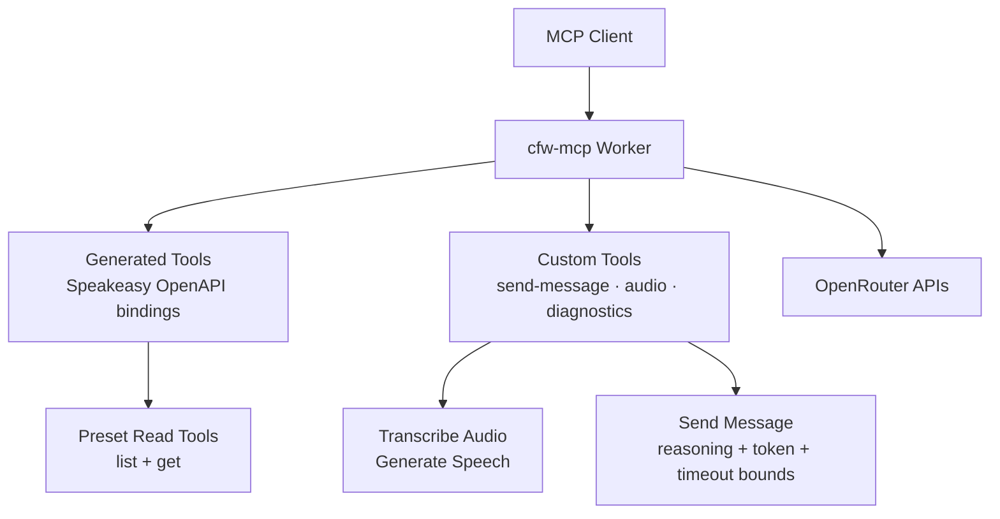

# cfw-mcp

Cloudflare Worker exposing OpenRouter capabilities through generated and
custom MCP tools, including inference, presets, diagnostics, and audio.

## Architecture



The first-party **OpenRouter MCP server**, served as a remote Cloudflare
Worker over Streamable HTTP. Developers connect by adding the URL in their
MCP client and logging in via OAuth — nothing is installed locally.

```bash
claude mcp add --transport http openrouter https://openrouter.ai/mcp/mcp
```

It is a **dev-helper, not a runtime inference client**: the tools give the
in-editor agent live OpenRouter context (models, pricing, credits,
rankings, docs) plus a slim `send-message` tool for exploratory calls. The
developer's production app still calls OpenRouter directly.

## Endpoints

The worker serves two surfaces on two Cloudflare routes:

- **`openrouter.ai/mcp*`** — the MCP endpoint + RFC 9728 resource metadata.
- **`mcp.openrouter.ai`** — the OAuth authorization server (`/oauth/*` +
  RFC 8414 metadata). It lives on its own subdomain so the apex
  `openrouter.ai` does not advertise itself as an OAuth issuer, which would
  constrain any future non-MCP OAuth (review #23985).

Resource host — **`openrouter.ai`**:

| Path | What |
| --- | --- |
| `/mcp/mcp` | MCP Streamable HTTP endpoint (bearer auth) |
| `/mcp/.well-known/oauth-protected-resource` | RFC 9728 resource metadata |
| `/mcp` | Health check (returns `ok`) |

Authorization server host — **`mcp.openrouter.ai`**:

| Path | What |
| --- | --- |
| `/.well-known/oauth-authorization-server` | RFC 8414 AS metadata |
| `/oauth/register` | RFC 7591 Dynamic Client Registration |
| `/oauth/authorize` | Authorization entry (302 to the `/auth` consent page) |
| `/oauth/token` | PKCE (S256) token exchange |

Unauthenticated requests to the MCP endpoint get a `401` with a
`WWW-Authenticate` header pointing at the RFC 9728 document, which directs
MCP clients to the OAuth authorization server on `mcp.openrouter.ai`
(RFC 8414 metadata, DCR, PKCE token exchange). The issued bearer token is a
standard `sk-or-v1-...` API key, minted with a dedicated 7-day expiry and a
`$10` default spend limit, labeled `MCP: <client>` so users can find and
revoke it.

### Authenticating from a client

Adding the server does **not** auto-trigger login — every client requires a
manual auth step:

- **Claude Code**: `claude mcp add --transport http openrouter
  https://openrouter.ai/mcp/mcp`, then run `/mcp` in a session, select
  `openrouter`, and click **Authenticate**. Claude Code has no CLI auth
  command yet, so it marks the server as needing auth until you do this once.
- **Codex CLI**: `codex mcp add openrouter --url
  https://openrouter.ai/mcp/mcp` then `codex mcp login openrouter`.
- **OpenCode**: add the server to `opencode.json`; it runs OAuth on first use.

## Development

```bash
bun run dev        # wrangler dev on :8804 (Infisical-injected env)
bun run test       # bun:test unit tests
bun run typecheck  # tsgo
```

Tilt: the `mcp` resource (manual trigger, `apis` label).

## Deployment

The worker ships via the shared `deploy-cloudflare-worker.yaml` on three
paths, all currently **nursery** (a failed deploy notifies but does not
block the release):

- **Release train** — `release.yaml` runs `upload-cfw-mcp` (`build-upload`)
  then `deploy-cfw-mcp` (`deploy`).
- **Hotfix** — `hotfix.yaml`'s `deploy-cfw-mcp` job (single-phase full
  build+deploy).
- **Ad-hoc** — the standalone `deploy-cfw-mcp.yaml` (`workflow_dispatch`):
  Actions → "Deploy cfw-mcp" → Run workflow. Use this for one-off pushes
  outside a release.

### Production infra (one-time, done)

- **Cloudflare routes** — `openrouter.ai/mcp*` (MCP endpoint) and
  `mcp.openrouter.ai` (OAuth AS) are bound to the `mcp` worker. The apex
  worker route is ordered above the Vercel `openrouter.ai/*` route. Verify:
  `curl https://openrouter.ai/mcp` returns `ok`.
- **Secrets** — the `/services/cfw-mcp` prod path in Infisical (project
  `771b7bc0-6578-41b0-886e-9fcdb66e9173`) syncs to the worker. The OAuth
  register/token flow stages DCR clients in Upstash Redis, so
  `UPSTASH_REDIS_REST_URL`/`_TOKEN` and `CF_KV_API_TOKEN` must be present on
  the worker, or `/oauth/register` 500s and login fails. `SERVICE_NAME`,
  `OPENROUTER_API_BASE_URL`, `MCP_PUBLIC_URL`, `OAUTH_ISSUER_URL`, and
  `SITE_URL` come from the sync (do not also declare them in `[vars]` — a
  name collision fails the sync with CF error 10053).
- **`global_fetch_strictly_public`** is set — the deployed worker cannot
  fetch loopback/private hosts (the platform-level SSRF guard); tools that
  fetch a caller-supplied URL additionally use `fetchWithSsrfGuard`.
- **Speakeasy licensing** — `mcp-typescript` is not on the org's approved
  target list (`speakeasy run` warns but succeeds).

### Local connect (static header, no OAuth)

```bash
claude mcp add --transport http openrouter \
  http://localhost:8804/mcp/mcp \
  --header "Authorization: Bearer sk-or-v1-..."
```

## Observability

Custom StatsD metrics and Datadog dashboard (`configs/terraform-monitors/monitoring/mcp/`):

| Metric | Description |
|--------|-------------|
| `openrouter.api.latency` | Per-request latency distribution via `timingMiddleware` (its `count` aggregation doubles as the request counter) |
| `mcp.request.method` | Counter per JSON-RPC method (bounded by `KNOWN_RPC_METHODS` allowlist) |
| `mcp.tool.call` | Counter per tool name (bounded by `KNOWN_TOOLS` allowlist) |
| `mcp.auth.*` | Auth counters with `outcome:*` tags on register/authorize/token routes |
| `mcp.request.rejected` / `mcp.request.timeout` | Origin/token guard rejections and 25s hang canary |

A `key_hash_first_ten` breadcrumb (`sha256(token).slice(0, 10)`) is logged per request for correlation without DB lookups. Upstream fetch hooks log `path`, `status`, `duration_ms` per SDK call (iLog only).

## Architecture notes

- **Stateless MCP**: one `McpServer` + one
  `WebStandardStreamableHTTPServerTransport` per request
  (`sessionIdGenerator: undefined`, JSON responses). The transport throws
  if reused.
- **Database**: the OAuth endpoints read and write Postgres through
  Hyperdrive, routed by the live config in `KV_LIVE_CONFIG`. The tools
  themselves proxy `https://openrouter.ai/api/v1` with the caller's bearer
  key, and `search-docs` proxies the Mintlify Discovery search API with the
  server-side `MINTLIFY_DISCOVERY_API_KEY`.
- **Origin validation**: present-but-invalid `Origin` headers are 403'd
  (MCP transport spec, DNS-rebinding defense). Missing Origin (non-browser
  clients) is allowed.
- **Workers-safe validation**: the MCP SDK's default ajv validator uses
  `new Function`, which Workers block; we pass
  `CfWorkerJsonSchemaValidator` instead.
- **Generated toolset** (Speakeasy `mcp-typescript` over
  `openrouter-openapi.yaml`) is committed under `generated/` and consumed by
  the worker via `src/mcp/build-mcp-server.ts`. Deny-by-default overlays
  (`generated/overlays/`) gate which operations become tools, so a new API
  endpoint never silently turns into a tool. Regen via `bun run regen` (see
  the `add-mcp-tool` skill, Part A). Current surface is 22 tools: 13 generated
  tools — 12 read (`list-models`, `get-model`, `list-model-endpoints`,
  `list-providers`, `list-daily-model-rankings`, `list-app-rankings`, `get-credits`,
  `get-generation`, `list-benchmarks`, `list-task-classifications`, `list-presets`,
  `get-preset`) plus the `send-feedback` write tool — + 9 custom.
- **Custom tools** — registered in
  `generated/src/mcp-server/server.extensions.ts` so they survive regen.
  `search-docs` (proxies the Mintlify Discovery search API over the OpenRouter
  docs), `send-message` (exploratory inference via the Responses API),
  `generate-image` (image generation via the images API), `transcribe-audio`,
  `generate-speech`, `spawn-ori-eval` (serves the `spawn-ori-eval` recipe
  fetched from the `OpenRouterTeam/skills` repo), `get-endpoint-uptime-history`,
  and `install-ori-harness` (serves the argument-free installation recipe
  fetched from the same repo) keep their logic in `src/tools/`; `ping` is
  self-contained in `generated/src/mcp-server/custom/pingTool.ts`.
- **Benchmarks tool** — single `list-benchmarks` tool over the unified
  `/api/v1/benchmarks` endpoint, with a required `source` arg
  (`artificial-analysis` | `design-arena`). A gated live integration test
  (`benchmarks-tool.live.test.ts`) catches upstream shape drift.

## Commands

| Command | Description |
| --- | --- |
| `bun run dev` | Start the local Worker |
| `bun run regen` | Regenerate Speakeasy bindings |
| `bun run test` | Run unit tests |
| `bun run test:integration` | Run integration tests |
| `bun run typecheck` | Type-check with tsgo |
| `bun run submit` | Deploy to Cloudflare |
