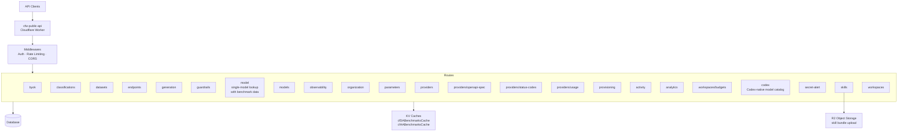

# cfw-public-api

Cloudflare Worker that serves OpenRouter's public-facing REST API routes. Routes are being progressively migrated here from `cfw-api` to separate public API surface from inference-path logic.

## Architecture

## Key Directories

| Directory                        | Purpose                                                                                                                                                                                                                                                                                                                                                                            |
| -------------------------------- | ---------------------------------------------------------------------------------------------------------------------------------------------------------------------------------------------------------------------------------------------------------------------------------------------------------------------------------------------------------------------------------- |
| `src/routes/`                    | Route handlers organized by domain (endpoints, models with KV-backed benchmark data, per-model reasoning config, offset/limit pagination, and expanded public pricing fields — `image_token`, `image_output`, `audio_output`, `input_audio_cache`, `pricing.overrides` — guardrails, skills, workspace budgets, activity, analytics, classifications, provider status-codes, etc.) |
| `src/routes/classifications/`    | Task classification market-share endpoint (`GET /api/v1/classifications/task`)                                                                                                                                                                                                                                                                                                     |
| `src/routes/skills/`             | Skills CRUD API with two-step upload-then-commit flow (R2-backed storage), version history, diff endpoints, batch file fetches, inference-key reads, and usage tracking                                                                                                                                                                                                            |
| `src/routes/workspaces/members/` | Workspace member listing (`GET /api/v1/workspaces/:id/members`) with pagination                                                                                                                                                                                                                                                                                                    |
| `src/routes/workspaces/budgets/` | Workspace budget CRUD — list, upsert, and delete budget thresholds (reads are available to workspace members; mutations require org-admin privilege)                                                                                                                                                                                                                               |
| `src/routes/codex/`              | Codex-native model catalog served on `/api/v1/models` for Codex CLI user agents, including base instructions                                                                                                                                                                                                                                                                       |
| `src/routes/activity/`           | Activity and analytics routes migrated from cfw-api (`/api/v1/activity`, `/api/v1/analytics`)                                                                                                                                                                                                                                                                                      |
| `src/routes/providers/`          | Provider OpenAPI spec route, per-provider status-codes API with Cache-Control and SWR deduplication, and usage API endpoint (`GET /api/v1/providers/{slug}/usage`) with hourly/daily/monthly granularity                                                                                                                                                                           |
| `src/middlewares/`               | Request middleware (auth, rate limiting)                                                                                                                                                                                                                                                                                                                                           |
| `src/utils/docs.ts`              | OpenAPI doc helpers — routes tag themselves with `'x-or-specs': ['management']` so management endpoints (workspaces, BYOK keys, guardrails, observability destinations, presets, budgets, org members) can be split into a dedicated management OpenAPI spec                                                                                                                       |
| `src/db/`                        | Database access layer                                                                                                                                                                                                                                                                                                                                                              |
| `src/utils/`                     | Shared utilities                                                                                                                                                                                                                                                                                                                                                                   |

## Commands

| Command          | Description            |
| ---------------- | ---------------------- |
| `bun run dev`    | Start local dev server |
| `bun run test`   | Run tests              |
| `bun run deploy` | Deploy to Cloudflare   |
