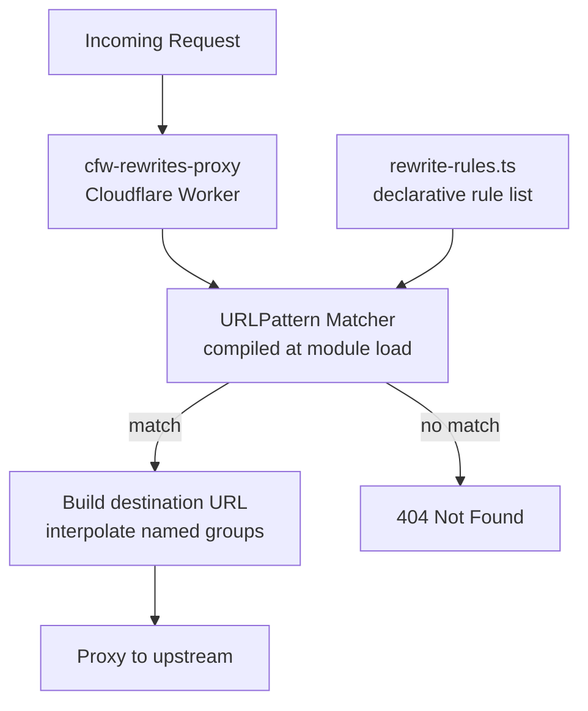

# cfw-rewrites-proxy

Lightweight Cloudflare Worker that proxies incoming requests to upstream URLs based on declarative path rewrite rules. Uses `URLPattern` for matching and named-group interpolation for destination templates. Rules are compiled once at module load for reuse across requests.

## Architecture

## Current Rewrite Rules

| Source Pattern | Destination |
|---------------|-------------|
| `/.well-known/skills/:skill/:path+` | GitHub raw `OpenRouterTeam/skills` |
| `/labs/spawn/:path+` | GitHub raw `OpenRouterTeam/spawn` |
| `/labs/ori/:asset+` | `OpenRouterLabs/ori-releases` latest release assets |

## Key Modules

| Path | Purpose |
|------|---------|
| `src/index.ts` | Worker entrypoint — compiles rules, matches requests, proxies to destinations |
| `src/rewrite-rules.ts` | Declarative `RewriteRule[]` mapping source patterns to upstream URLs |

## Commands

| Command | Description |
|---------|-------------|
| `bun run dev` | Start local dev server (with Infisical secrets) |
| `bun run start` | Start wrangler dev server |
| `bun run test` | Run unit tests |
| `bun run submit` | Deploy to Cloudflare |
| `tsgo --noEmit` | Type-check |
