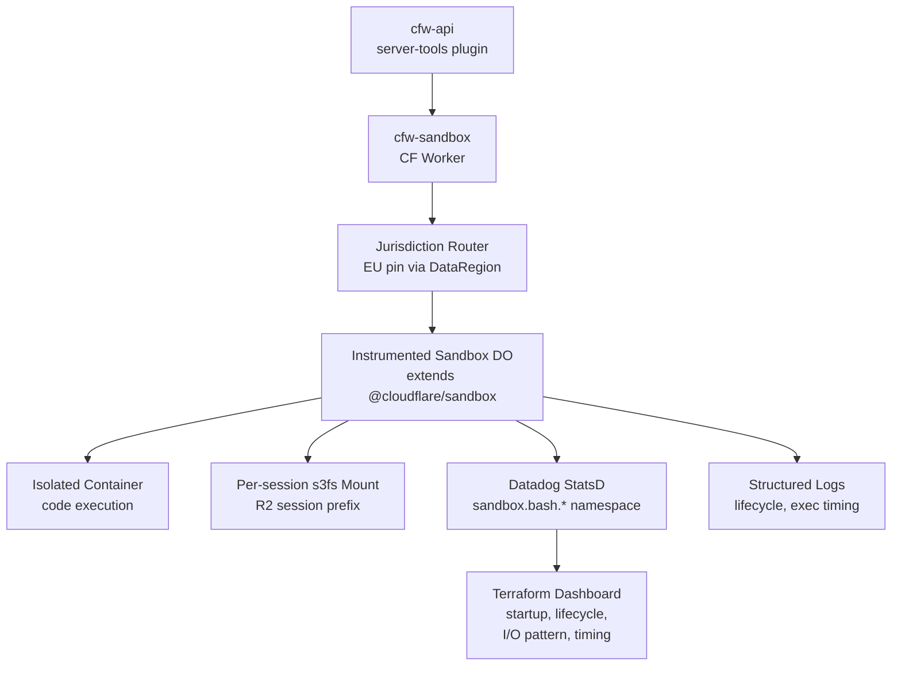

# cfw-sandbox

cfw-sandbox is a thin Cloudflare Worker that wraps `@cloudflare/sandbox` for containerized tool execution. It provides an isolated runtime environment where server tools can execute untrusted code through Durable Objects. The Worker supports EU data residency by pinning Durable Objects to the EU jurisdiction based on the caller's data region. It mounts a per-session R2-backed s3fs volume for attached workspace files (selected through `file_ids`), so a container sees exactly its attached files and the source documents are never modified. Datadog StatsD metrics and structured logs instrument the container lifecycle, startup time, and per-exec I/O timing.

## Architecture

## Key modules

| Path | Purpose |
|------|---------|
| `src/index.ts` | Worker entrypoint — routes requests to jurisdiction-pinned or global DOs based on `DataRegion`, exports `ContainerProxy` for R2-binding bucket mounts, persists start time and exec count across DO evictions |
| `src/sandbox.ts` | Instrumented `Sandbox` subclass — `execWithMounts` orchestrates the per-session s3fs mount and file attach before exec, times lifecycle hooks, emits metrics/logs |
| `src/exec-flow.ts` | Testable mounts → watch → exec → flush → report sequencing behind `execWithMounts` |
| `src/file-change-watcher.ts` | Best-effort changed-file detection over the SDK's native file watch (inotify SSE stream) |
| `src/schemas.ts` | Request/response schemas including `DataRegion`-to-jurisdiction mapping |
| `src/sandbox-metrics.ts` | Pure metric builders + lifecycle helpers (no CF imports, fully unit-testable) |
| `src/diagnostics.ts` | `CloudflareStatsd` dispatcher publishing to the `statsd` diagnostics channel |

## Commands

| Command | Description |
|---------|-------------|
| `wrangler dev` | Start the local development server |
| `wrangler deploy` | Deploy to Cloudflare |
| `bun test` | Run unit tests |
| `wrangler types` | Regenerate the Cloudflare type bindings |

## Local development on Linux

On some Linux hosts, the `wrangler dev` egress-interceptor sidecar exits at startup and `/exec` keeps returning `SandboxError: Container is starting`. For more information about the failure modes and the [`scripts/local-dev-egress.sh`](./scripts/local-dev-egress.sh) workaround, see [`AGENTS.md`](./AGENTS.md).
