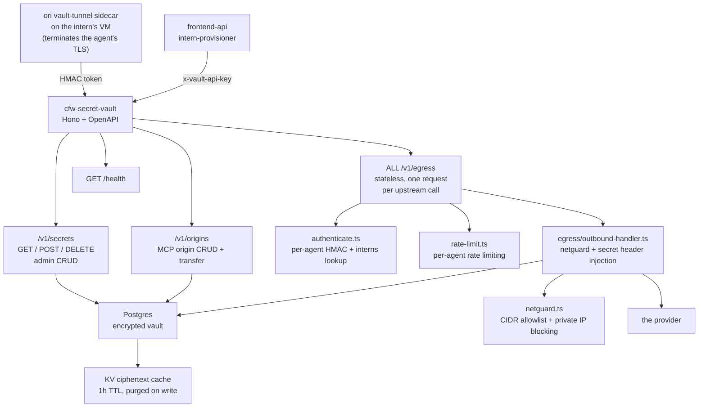

# cfw-secret-vault

Cloudflare Worker that securely resolves and injects secrets into agent egress. Fetches secrets from a Postgres-backed encrypted vault (two-tier: master key → per-vault key → secret), caches the **ciphertext** in KV for an hour (never a resolved value — decryption stays in the Worker), and injects a credential on the last hop out, so an intern's VM never holds a resolved secret.

One door reaches that injector:

- **`/v1/egress`** (stateless) — one ordinary HTTP request per upstream call. Nothing on the path holds state, so a deploy replaces isolates and the next request succeeds.

The intern terminates its own TLS, in the `ori vault-tunnel` sidecar on its own VM, against a CA that sidecar mints locally. Until [ORI-1912](https://linear.app/openrouter/issue/ORI-1912) that happened in a Cloudflare Container reached over a WebSocket through a Durable Object, with one root CA in this Worker that every intern trusted — and every deploy of this service reset those objects and dropped every live tunnel. Nothing on the request path is stateful now, and there is no shared root CA.

> **Operating this service** — credential map, rotation runbook, and failure
> diagnosis live in [`AGENTS.md`](./AGENTS.md). Read it before rotating any
> vault credential: the same key exists under three names in three Infisical
> paths, and the vault logs nothing when it rejects one.

## Authentication

Two distinct mechanisms, easy to conflate:

- **Static admin API key** (`VAULT_API_KEY`, presented as `x-vault-api-key`,
  compared timing-safe). Gates `GET`/`POST`/`DELETE /v1/secrets` and the
  `/v1/origins` routes. Its callers are `cfw-frontend-api` and the local
  seeder; no intern holds it.
- **Per-agent HMAC token** (`X-Agent-Token`, derived from `VAULT_SIGNING_SECRET`
  over `workspaceId\0agentId`). The sole gate on `/v1/egress`, the only
  intern-facing door. It binds a caller to one workspace+agent pair, so a
  leaked `VAULT_API_KEY` still cannot reach another tenant's secrets. It lives
  in `src/authenticate.ts`, and it also confirms the pair is a live,
  unarchived `interns` row — deliberately uncached, because an authorisation
  decision that is cached keeps authorising an archived intern.
- **Acting-user assertion** (`x-agent-acting-user` + `x-agent-acting-user-mac`,
  the MAC keyed with the agent token). Not an authentication of the caller but
  of a claim the caller makes: which member the request acts as. Written by
  the sidecar and by nobody else, read in `src/egress/acting-user.ts`, and the
  only identity a member-bound credential (a member's Google link) is released
  against. See "The acting member on `/v1/egress`" in `AGENTS.md`.

## Architecture



## Key Modules

| Path | Purpose |
|------|---------|
| `src/routes/secrets.ts` | Admin CRUD for stored secrets — gated on `VAULT_API_KEY`, scoped by `x-vault-workspace-id` |
| `src/routes/origins.ts` | MCP origin CRUD and transfer — same admin gate |
| `src/egress/egress-route.ts` | `ALL /v1/egress` — the only intern-facing door: authenticate, rate limit, read `x-egress-target`, hand the rebuilt request to the injector, stream the answer back |
| `src/egress/outbound-handler.ts` | The injector — netguard, host allowlist, smuggled-credential rejection, host- and placeholder-mode injection, upstream `fetch` |
| `src/authenticate.ts` | The per-agent HMAC check plus the `interns` authorisation lookup |
| `src/egress/acting-user.ts` | Classifies the sidecar's acting-user assertion: `absent`, `asserted`, `none` or `invalid` |
| `src/google-grant-injection.ts` | A member's Google grant, minted for the asserted member's own link and for nobody the agent names |
| `src/routes/health.ts` | Health check endpoint |
| `src/secret-store/` | Postgres-backed encrypted secret store (two-tier envelope encryption), plus the KV ciphertext cache that fronts its two read queries |
| `src/netguard.ts` | Network guard — blocks private IP ranges, supports CIDR allowlists |
| `src/host-allowlist.ts` | Host-level allowlist for outbound requests |
| `src/crypto-utils.ts` | HMAC token derivation/verification and timing-safe comparison |
| `src/rate-limit.ts` | Per-agent rate limiting |

## Secret Access Logs

Every path that reads or mutates a secret emits a structured log. These are
shipped to Datadog by the `cfw-instrumentation` tail worker. **Values are never
logged** — secret *names* and injection *modes* are the deliberate boundary.

### Access records

| Event | Emitted at | Fields |
|-------|-----------|--------|
| `secret_resolved` | `src/secret-store/postgres-secret-store.ts` | `workspace_id`, `agent_id`, `secret_name` |
| `outbound_secrets_injected` | `src/egress/outbound-handler.ts` | `agent_id`, `hostname`, `mode`, `placeholder_count` |
| `outbound_github_unconfigured` | `src/egress/outbound-handler.ts` | `agent_id`, `session_id`, `acting_user`, `hostname` — a GitHub call from an intern no GitHub connection applies to, forwarded unauthenticated; not a credential failure |
| `list_secrets` | `src/routes/secrets.ts` | `agent_id`, `count` |
| `put_secret` | `src/routes/secrets.ts` | `agent_id`, `secret_name`, `secret_id` |
| `delete_secret` | `src/routes/secrets.ts` | `agent_id`, `secret_name` |

One upstream call produces two kinds of record: the injector emits one
`outbound_secrets_injected` for the request, and the store emits one
`secret_resolved` per name it read. **A complete picture of one agent's access
requires querying both.** `openrouter.vault_egress.request` counts requests
through the door itself, including the ones that never got as far as a
secret.

### Querying

The event name is the log's top-level `message`; the fields above are nested
under `@extra.*`. The tail worker adds `@script_name`, `@cf_ray_id`, `@url`,
`@response_status`, and `@version` to every entry.

Everything an agent touched:

```
service:cfw-secret-vault @extra.agent_id:<AGENT_ID>
```

Narrow to a single event type, or to one secret:

```
service:cfw-secret-vault message:secret_resolved @extra.agent_id:<AGENT_ID>
service:cfw-secret-vault @extra.secret_name:<SECRET_NAME>
```

Writes only (who changed the vault):

```
service:cfw-secret-vault (message:put_secret OR message:delete_secret)
```

### Limits — this is a best-effort access log, not an audit log

These records are unsigned, mutable-by-retention application logs on a lossy
pipeline: uploads are skipped silently when the pipeline consumer has no
`DD_API_KEY`, delivery is at-least-once with no deduplication, sampling
applies, Cloudflare truncates oversized per-invocation output, and retention is
bounded by the Datadog index.

See [`AGENTS.md`](./AGENTS.md) for what that means in practice and why these
logs must not be extended into an audit trail.

For item **mutations** there is a real audit trail:
`public.agent_vault_audit_log`, written transactionally by the store layer and
read through `GET /api/frontend/v1/private/vault-secrets/audit`. It covers
create/update/delete only — reads are still just the best-effort access log
above. See the ORI-1249 section in [`AGENTS.md`](./AGENTS.md) for its
limitations.

## Commands

| Command | Description |
|---------|-------------|
| `bun run dev` | Start local dev server (with Infisical secrets) |
| `bun run start` | Start wrangler dev server |
| `bun run test` | Run unit tests |
| `bun run submit` | Deploy to Cloudflare |
| `tsgo --noEmit` | Type-check |
