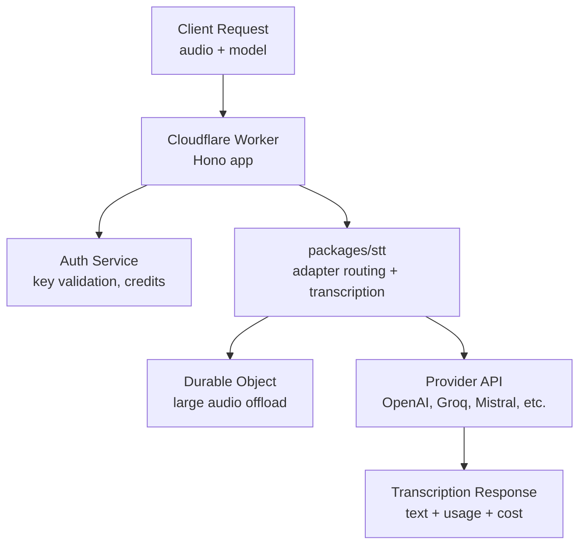

# CFW STT API

Cloudflare Worker service for OpenRouter's speech-to-text API. Hosts the `/api/v1/audio/transcriptions` endpoint, wiring authentication, Durable Object streaming, and the STT package's adapter pipeline into a deployable Worker.

## Architecture

## Key Modules

| Path | Purpose |
|------|---------|
| `src/index.ts` | Worker entry point |
| `src/app.ts` | Hono app setup with middleware |
| `src/routes/` | Route definitions |
| `src/env.ts` | Worker environment bindings |
| `src/db/` | Database access layer |
| `src/kv/` | KV namespace bindings |
| `src/live-config.ts` | Runtime configuration from KV |

## Commands

| Command | Description |
|---------|-------------|
| `bun run dev` | Start local development server |
| `bun run test` | Run unit tests |
| `bun run test:watch` | Run tests in watch mode (vitest) |
| `bun run submit` | Deploy to Cloudflare |
| `bun run typecheck` | Type-check with tsgo |
| `bun run cf:bundle` | Dry-run deploy to inspect bundle |
