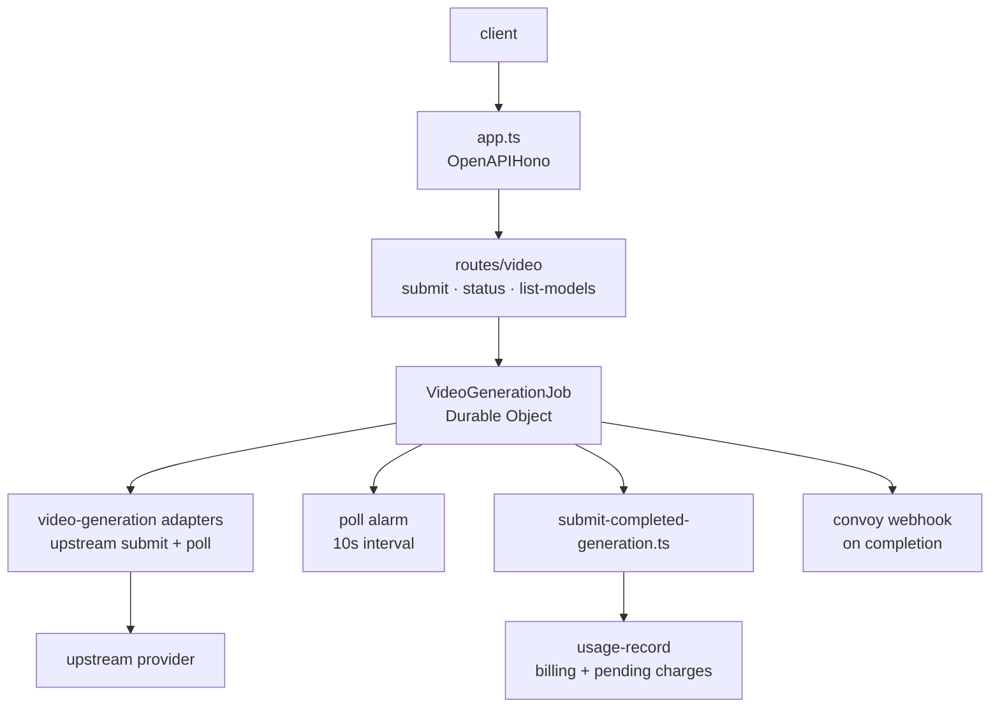

# cfw-video-api

Cloudflare Worker that serves OpenRouter's asynchronous video-generation API. It accepts video jobs, hands each one to a `VideoGenerationJob` Durable Object that submits to the upstream provider and polls for completion on an alarm, then bills the result through `usage-record`. Routing, adapters, and pricing come from the shared `video-generation`, `router`, and `routing` packages.

## Architecture

## Routes

| Path | Purpose |
|------|---------|
| `POST /api/v1/videos` | Submit a video-generation job |
| `GET /api/v1/videos/:id` | Fetch a video job's status/result |
| `GET /api/v1/videos/models` | List available video models |

Routes are also mounted under `/api/alpha/videos`.

## Commands

| Command | Description |
|---------|-------------|
| `bun run dev` | Start local dev server (Infisical-injected env) |
| `bun run start` | Start with `wrangler dev` |
| `bun run submit` | Deploy to Cloudflare |
| `bun test` | Run unit tests |
| `bun run test:cfw` | Run Durable Object Worker tests (vitest) |
| `bun run typecheck` | Type-check |
