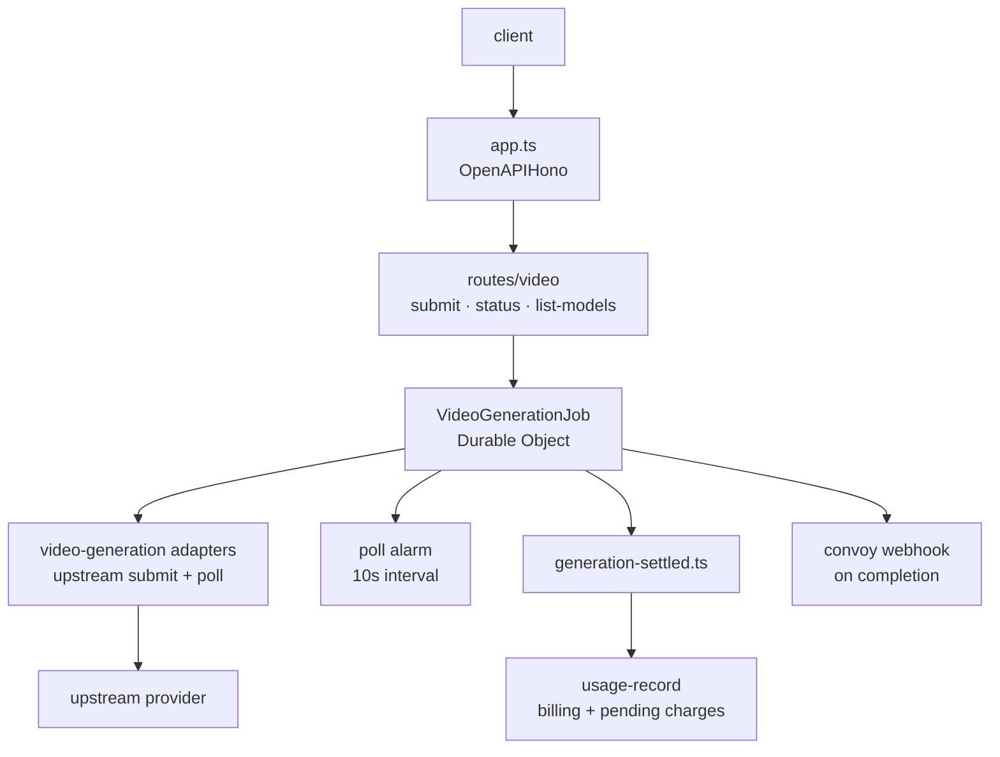

# cfw-video-api

Cloudflare Worker that serves OpenRouter's asynchronous video-generation API. It accepts video jobs, hands each one to a `VideoGenerationJob` Durable Object that submits to the upstream provider and polls for completion on an alarm, then bills the result through `usage-record`. Routing, adapters, and pricing come from the shared `video-generation`, `router`, and `routing` packages.

## Architecture

```mermaid
graph TD
    Client["client"] --> App["app.ts\nOpenAPIHono"]
    App --> VideoRoute["routes/video\nsubmit · status · list-models"]
    VideoRoute --> DO["VideoGenerationJob\nDurable Object"]
    DO --> Adapter["video-generation adapters\nupstream submit + poll"]
    Adapter --> Upstream["upstream provider"]
    DO --> Alarm["poll alarm\n10s interval"]
    DO --> Submit["generation-settled.ts"]
    Submit --> Usage["usage-record\nbilling + pending charges"]
    DO --> Webhook["convoy webhook\non completion"]
```

## Job Lifecycle

`src/durable-objects/lifecycle.ts` names three awaited, in-process events: `jobStarted`, `generationSettled`, and `jobFinalized`. Reservation handlers and settlement collaborators are shared with the complete video feature catalog in `packages/video-generation/lifecycle/job-features.ts`. The Durable Object supplies job facts and its existing services, not callback overrides.

Storage, polling, and retries remain in `VideoGenerationJob`. Reservations are acquired at the existing post-start boundary. Settlement still waits for provider-usage persistence; terminal status and webhooks precede reservation release and storage cleanup. The renamed settlement handler preserves its existing test-only collaborator overrides, but the production job does not pass them. There are no subscriptions or generic event dispatch.

## Routes

| Path | Purpose |
|------|---------|
| `POST /api/v1/videos` | Submit a video-generation job |
| `GET /api/v1/videos/:id` | Fetch a video job's status/result |
| `GET /api/v1/videos/models` | List available video models |

Routes are also mounted under `/api/alpha/videos`.

## Commands

| Command | Description |
|---------|-------------|
| `bun run dev` | Start local dev server (Infisical-injected env) |
| `bun run start` | Start with `wrangler dev` |
| `bun run submit` | Deploy to Cloudflare |
| `bun test` | Run unit tests |
| `bun run test:cfw` | Run Durable Object Worker tests (vitest) |
| `bun run typecheck` | Type-check |
