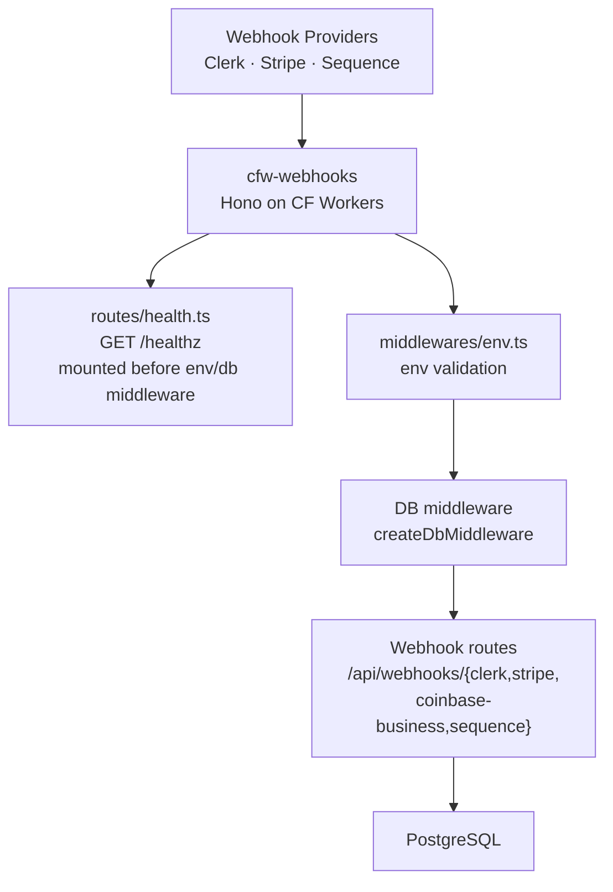

# cfw-webhooks

Cloudflare Worker that hosts inbound webhook handlers being ported off the Next.js web app. Clerk, Stripe, Coinbase Commerce and Sequence routes are implemented and mount under `/api/webhooks/*`, plus a `/healthz` liveness probe.

> **No production route points at this worker yet** — production webhooks are still served by `projects/web/pages/api/webhooks/*` on Vercel, so instrumentation added here produces no prod signal. See [AGENTS.md](./AGENTS.md) for the traffic evidence and the queries to re-check it.

## Architecture

## Key Files

| Path | Purpose |
|------|---------|
| `src/index.ts` | Worker entrypoint — registers Cloudflare statsd, breadcrumbs, and instruments the app |
| `src/app.ts` | `createApp()` — Hono app factory with error handling, env/db middleware, and route mounting |
| `src/env.ts` | Worker environment bindings (`CfwWebhooksEnv`) |
| `src/middlewares/env.ts` | Environment validation middleware |
| `src/routes/health.ts` | Liveness probe, mounted before env/db middleware so it never depends on a DB connection |

## Commands

| Command | Description |
|---------|-------------|
| `bun run dev` | Start local dev server (Infisical-injected env) |
| `bun run start` | Start with wrangler dev |
| `bun test` | Run unit tests |
| `bun run typecheck` | Type-check |
| `bun run submit` | Deploy to Cloudflare |
