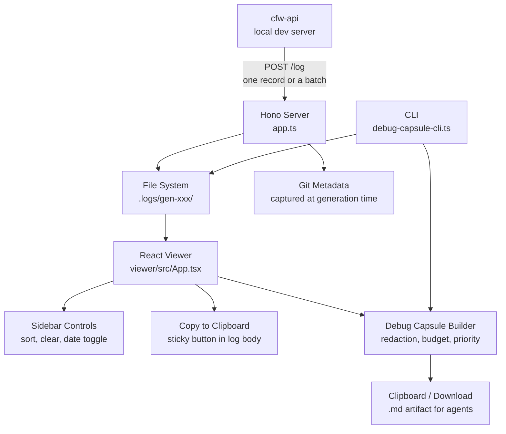

# Dev FS Logs

Local development log viewer and agent debug capsule generator for OpenRouter. Captures per-generation request/response logs written by cfw-api during local development, serves a React-based log viewer UI, and produces one-click debug capsules for sharing generation context with AI agents.

## Architecture

## Key Modules

| File | Purpose |
|------|---------|
| `index.ts` | Entry point — serves `createLogApp` on `FS_LOG_PORT` |
| `app.ts` | Hono app — receives log POSTs, writes to disk, serves viewer and API routes |
| `log-records.ts` | Reads a `/log` payload as either a `{records:[…]}` batch or one bare record |
| `viewer/src/App.tsx` | React log viewer with syntax highlighting, generation grouping, context menu actions, copy-to-clipboard, sidebar sort/clear/date-toggle |
| `debug-capsule-format.ts` | Shared capsule builder — priority-based file selection, budget allocation, safe-boundary truncation |
| `debug-capsule.ts` | Server-side capsule generation with file system access |
| `debug-capsule-cli.ts` | CLI entry point (`tsx debug-capsule-cli.ts <generation>`) |
| `debug-context.ts` | Generation-time debug context (git metadata, timestamps) |
| `git-metadata.ts` | Git branch/commit/status capture, async so it never blocks the event loop |
| `queue.ts` | Sequential task queue for file writes |

## Commands

| Command | Description |
|---------|-------------|
| `bun run dev` | Start log server + viewer (hot-reload) |
| `bun run dev:server` | Start log server only |
| `bun run dev:viewer` | Start viewer only |
| `bun run build:viewer` | Build viewer for production |
| `tsx debug-capsule-cli.ts <gen-id>` | Generate debug capsule to stdout |
| `bun run typecheck` | Type-check server and viewer |
