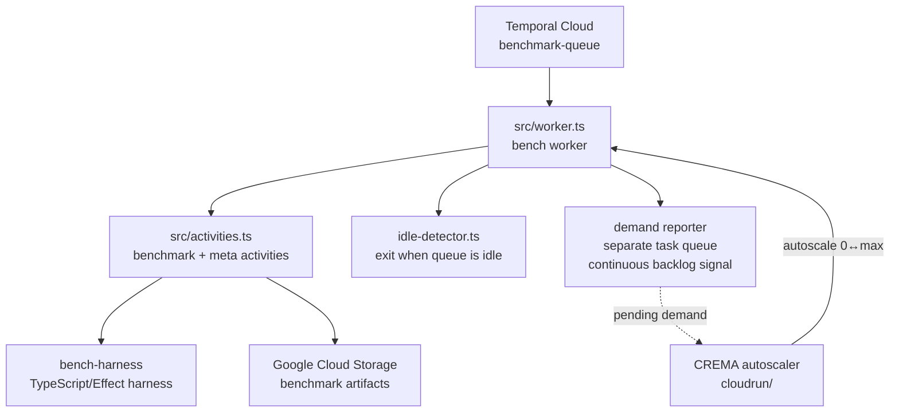

# Bench Worker

Temporal worker that runs OpenRouter's benchmark harness (TypeScript/Effect) against LLM models. It polls the `benchmark-queue`, executes benchmark + meta workflows (auto-exacto, sweep), and uploads artifacts to GCS for retrieval via Mission Control.

> The Python **openbench** harness has been retired. This worker now runs only the harness defined in `@openrouter/bench-harness`; auto-exacto and sweep were cut over to it ([PR #26679](https://github.com/OpenRouterTeam/openrouter-web/pull/26679)).

## Architecture



## Repository Layout

| Path | Description |
|------|-------------|
| `src/worker.ts` | Worker entrypoint |
| `src/activities.ts` | Benchmark + meta-workflow activities |
| `src/idle-detector.ts` | Exits the worker once the queue drains |
| `src/telemetry.ts` | OpenTelemetry setup |
| `cloudrun/` | Terraform for the Cloud Run Worker Pool + CREMA autoscaler |
| `infra/` | Terraform for supporting GCP infrastructure |
| `Dockerfile` | Production container image (node:slim) |

## Compute

The worker runs as two Cloud Run Worker Pools, selected by `BENCH_WORKER_ROLE`:

- **`bench-worker-native`** (`BENCH_WORKER_ROLE=activity`): runs activities only — no workflow bundle, so it opens zero workflow-task polls. CREMA watches the `benchmark-queue` activity backlog and scales the pool 0↔max; the max-instance cap and per-instance resource sizing live in `cloudrun/worker-pool.tf` (`max_instance_count`, container `resources`) and the CREMA ceiling in `cloudrun/crema.tf` (`maxReplicaCount`). Instances are right-sized to one activity each (`maxConcurrentActivityTaskExecutions: 1` in `src/worker.ts`) so the unit of scale equals the unit of work and a crash loses at most one activity.
- **`bench-worker-native-workflow`** (`BENCH_WORKER_ROLE=workflow`): runs workflow tasks and the pending-chunks metric reporter on a small fixed pool (`cloudrun/workflow-pool.tf`). Splitting workflow polling off the scaled pool keeps Temporal namespace poll RPS independent of activity instance count.

Locally the default role is `combined` (both). See `cloudrun/` and `cloudrun/crema-image/README.md`.

## Local Development

```bash
bun install
bun run dev   # tsx src/worker.ts, env injected by Infisical
```

`bun run dev` connects to Temporal (Cloud when `TEMPORAL_API_KEY` is set) and starts the worker. Without `BENCHMARK_RESULTS_BUCKET`, GCS artifact upload is skipped gracefully; set it to write to a real bucket:

```bash
export BENCHMARK_RESULTS_BUCKET=openrouter-core-openbench-results-dev
bun run dev
```

You can trigger a run from the CLI harness:

```bash
infisical run --env=dev -- bunx tsx scripts/temporal/run-auto-exacto.ts
```

### Temporal Cloud Configuration

| Variable | Format | Example |
|----------|--------|---------|
| `TEMPORAL_ADDRESS` | `<region>.<cloud_provider>.api.temporal.io:7233` | `us-east-1.aws.api.temporal.io:7233` |
| `TEMPORAL_NAMESPACE` | `<namespace_id>.<account_id>` | `my-namespace.abc123` |
| `TEMPORAL_API_KEY` | API key from Temporal Cloud | `eyJ...` |

The worker enables TLS automatically when `TEMPORAL_API_KEY` is set.

## Commands

| Command | Description |
|---------|-------------|
| `bun run dev` | Run the worker locally (Infisical-injected env) |
| `bun run build` | Bundle the worker and workflows |
| `bun test` | Run unit tests |
| `bun run typecheck` | Type-check |

## Terraform

```bash
cd services/gcp-bench-worker/cloudrun
bun run terraform-or init
bun run terraform-or plan
bun run terraform-or apply
```
