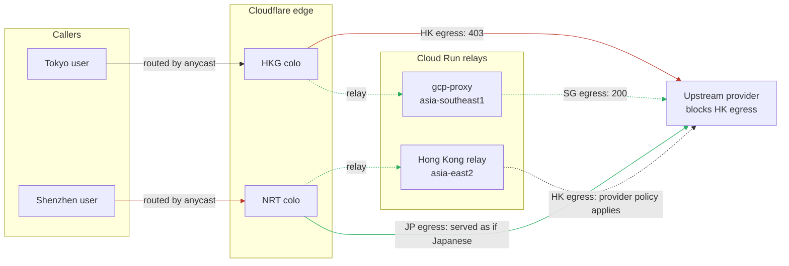
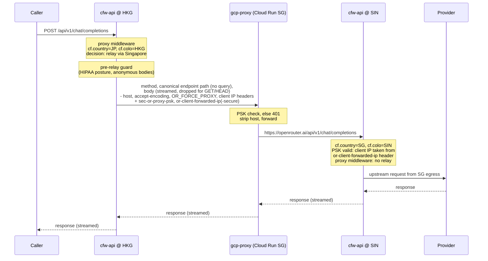
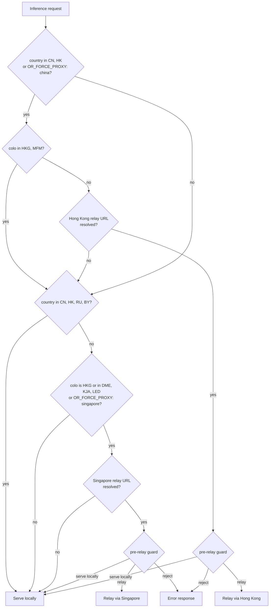

# gcp-proxy: regional egress relays

`gcp-proxy` is a small Hono service that runs on Cloud Run as regional relays in Singapore (`asia-southeast1`) and Hong Kong (`asia-east2`). cfw-api forwards selected inference requests to one of these instances, and the instance forwards them back to `https://openrouter.ai`. The only thing that changes is the IP address the request arrives from on the second hop, and therefore the IP address upstream providers see when the request is served.

## Why it exists

Some upstream providers hard-block requests by source IP location. Cloudflare's Hong Kong colo (HKG) is inside those blocked ranges, and Cloudflare routes a large share of APAC users who are not in China or Hong Kong (Japan, Korea, Taiwan, Southeast Asia, Australia) to HKG. When cfw-api served those requests in HKG, providers saw a Hong Kong egress IP and rejected them (the original incident was Anthropic returning 403s in November 2024). The same problem exists for callers routed to the Russian colos (DME, KJA, LED).

The relays fix this without misrepresenting anyone.

- **Singapore relay.** A caller who is not from CN, HK, RU or BY but landed at HKG or a Russian colo is relayed through Singapore, so upstream sees a Singapore egress and serves the request. This is the case the relay was built for.
- **Hong Kong relay.** A caller who is from CN or HK but landed at a colo outside HKG and MFM is relayed through Hong Kong, so upstream sees a Hong Kong egress and applies its own regional policy. Without this hop the caller would be presented to the provider as whatever region Cloudflare happened to route them to.

The rule is symmetric. A non-Chinese caller must never be presented as Chinese, and a Chinese caller must never be presented as non-Chinese. RU and BY callers are never relayed either way.

Solid red edges are what happened before the relays. Dashed green edges are the relayed path.

## How a request flows

The relay is a second trip through Cloudflare. cfw-api at the first-hop colo builds a new request to the relay origin, the relay checks a shared secret and forwards the request to `openrouter.ai` with only the `host` header dropped, and the request lands on a second cfw-api isolate at whichever colo Cloudflare picks for Google's egress IP. That second isolate runs the full inference path and calls the provider.

The rules for changing the middleware or the relay (which workers relay, body streaming, what the second hop trusts, repeated relays) live in [AGENTS.md](./AGENTS.md).

## Routing decision

The decision is made from two Cloudflare request fields, `cf.country` and `cf.colo`, before the body is read and before the model or provider is known. The decision is the same for every model and provider.

Source of truth: `services/cfw-api/src/middlewares/proxy.ts` (`shouldProxyRequestsToChinaSpecificEndpoint`, then `shouldProxyRequestsToMixedColoIfNotFromChina` when the first returns no relay), tested in `services/cfw-api/src/middlewares/proxy.test.ts`. Update this diagram when those sets or predicates change.

The pre-relay guard is the HIPAA dispatch check. It refuses to send a HIPAA-routed workspace's request out of region, serves anonymous and unresolved-cookie requests locally so an unattributed body never crosses a region boundary, and relays everything else. If a relay URL cannot be resolved from the environment an error is logged and the request falls through: an unresolved Hong Kong URL continues to the Singapore rule, and an unresolved Singapore URL serves locally. A China-branch request at HKG or MFM also continues to the Singapore rule, so a caller outside CN and HK who sends `OR_FORCE_PROXY: china` at HKG is relayed via Singapore.

The `OR_FORCE_PROXY` header (`singapore` or `china`) is how the relays are tested from outside the affected regions. It does not override the other rules: `china` does not relay from HKG or MFM, and `singapore` does not relay callers from CN, HK, RU or BY. Mounts that set `testFlagOnly` relay to Singapore only when the header asks for it.

## Failure behaviour

Once a request is sent to a relay, a relay failure is not retried locally. Serving a Singapore-eligible request locally would send it to the provider from the HK egress the relay exists to avoid. A missing relay URL is a configuration case, handled before the relay is attempted, and serves locally or falls through as described above.

- If Cloudflare's edge returns a 52x or 530 for the relay origin, cfw-api replaces it with an OpenRouter-shaped 502.
- If the relay or Cloud Run returns its own 4xx or 5xx, that response is passed to the client verbatim.
- If the `fetch` to the relay throws (connection refused, timeout), the error escapes the middleware and the app-level handler returns a 500.

A relay outage is therefore a hard outage for every request that meets the routing rule. A 502/503 degradation path with a stable error code is tracked in PLA-2558.

## Configuration

| Item                   | Value                                                                                                                                |
| ---------------------- | ------------------------------------------------------------------------------------------------------------------------------------ |
| Singapore relay origin | `OR_PROXY_URL` in cfw-api                                                                                                            |
| Hong Kong relay origin | `OR_HONG_KONG_PROXY_URL` in cfw-api                                                                                                  |
| Shared secret          | `OR_PROXY_PSK`, same value in cfw-api and both relays, sent as `sec-or-proxy-psk`                                                    |
| Client IP headers      | `or-client-forwarded-ip` and `or-client-forwarded-ip-secure` (constants in `packages/enums/proxy.ts`), trusted only with a valid PSK |
| Relay listen port      | 3000                                                                                                                                 |

This repo's `cloudbuild.yaml` builds the image and deploys only the `gcp-proxy` service in `asia-southeast1`. The Hong Kong relay in `asia-east2` is deployed outside this repo's build, so a merge to `main` does not redeploy it. Deployment, monitoring and the planned cutover to Terraform-managed services are tracked in [PLA-2551](https://linear.app/openrouter/issue/PLA-2551).

## History

- **2024-11.** HKG-colo requests were redirected to the Vercel origin after Anthropic began returning 403 for requests with a Hong Kong egress.
- **2025-04 (OPE-3403).** Replaced with `gcp-proxy` in Singapore so the hop is our own infrastructure, gated by a shared secret.
- **2025-09 (ENT-22).** Added the Hong Kong relay for CN and HK callers landing outside HKG and MFM.
- **2025-12.** Extended the Singapore relay to non-Russian callers landing at DME, KJA and LED.
