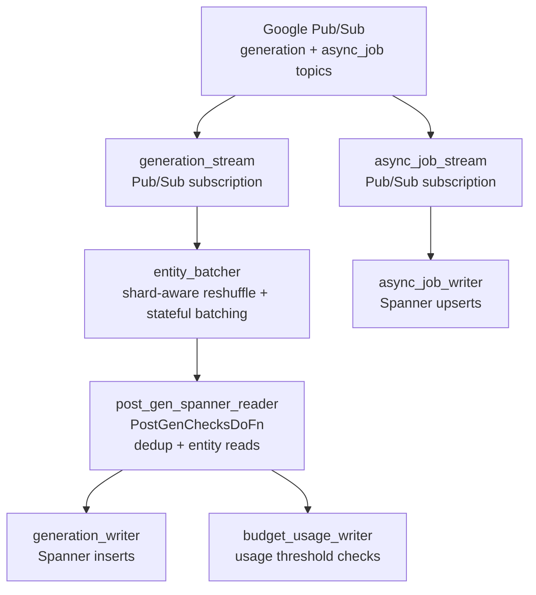

# Dataflow

[GCP Dataflow][dataflow] pipelines responsible for inserting usage data into
the usage-record Spanner database. GCP Dataflow is Google's hosted
implementation of the [Apache Beam][beam] framework, and can perform both
streaming and batch data processing with automatic autoscaling, retries, etc.
We use their Python SDK for this job.

## Architecture



## Pipelines

| Pipeline | Trigger | Purpose |
|----------|---------|---------|
| Generation stream | Pub/Sub subscription | Writes generation records to Spanner, batched by billable entity |
| Async job stream | Pub/Sub subscription | Upserts async job charge records (batch API billing) |

## Generation lanes and shard ranges

The generation stream runs as two production jobs, or **lanes**, that consume
separate Pub/Sub subscriptions off the same topic: the **interactive** lane
(`usage-record-generations-*`, synchronous billing) and the **batch** lane
(`usage-record-batch-generations-*`, batch API generations). Lane defaults
live in `src/openrouter_monorepo/usage_record/generation_lane.py`.

Both lanes write the per-entity `generation_shards` / `budget_usage` rows,
keyed by `(billable_entity_id, started_at_shard_id)`. To keep them from
contending on the same rows, the 16 write shards are split between them:

| Lane | Write shards |
|------|--------------|
| Interactive | `0-13` |
| Batch | `14-15` (`BATCH_LANE_SHARD_COUNT`) |

Readers aggregate `SUM(shard_total_usage)` across all shards, so the split
only changes write placement. `--min-shard-index` / `--max-shard-index` still
override a lane's range, but only on staging deploys; production always uses
the lane defaults. Changing `GENERATION_SHARDS_COUNT_WRITE` or
`BATCH_LANE_SHARD_COUNT` requires redeploying both lanes together so the
ranges stay disjoint.

## Key Modules

| Path | Purpose |
|------|---------|
| `src/openrouter_monorepo/usage_record/generation_stream.py` | Generation Pub/Sub → Spanner pipeline |
| `src/openrouter_monorepo/usage_record/generation_lane.py` | Interactive vs batch lane defaults: subscription, DLQ folder, batcher knobs, write shard range |
| `src/openrouter_monorepo/usage_record/entity_batcher.py` | Shard-aware reshuffle and stateful batching by billable entity |
| `src/openrouter_monorepo/usage_record/generation_commits_stream.py` | Deterministic bounded logical shard key and `GroupIntoBatches` for generation-commit batching |
| `src/openrouter_monorepo/usage_record/post_gen_spanner_reader.py` | `PostGenChecksDoFn` — deduplicates in-DoFn, reads entity totals from Spanner |
| `src/openrouter_monorepo/usage_record/generation_writer.py` | Spanner generation inserts |
| `src/openrouter_monorepo/usage_record/async_job.py` | Async job charge handling |
| `src/openrouter_monorepo/usage_record/dlq_import.py` | DLQ replay pipeline (replays generations or async-jobs from GCS) |

## Local development

See the [usage-record README](../README.md) for instructions
on running the full pipeline locally (with or without Tilt).

## Deployment

This task is deployed as a [Flex Template][flex-template], which is basically
a fancy way of saying the Python app is packaged as a Docker container.

To deploy a new version, enter the `services/usage-record` directory and run
the following commands:

```bash
gcloud auth login --update-adc
gcloud auth configure-docker us-docker.pkg.dev
bun run x scripts/dataflow-deploy.ts
```

This will build a new Docker image locally, push it, and trigger a zero-downtime
upgrade of the Dataflow job.

Generation-commit batching uses a deterministic bounded logical shard key with
16 shards by default. The shard count is part of Dataflow's state key space,
so a change must never go out through an in-place `--update`. The deploy
script rejects `--replace` for this pipeline; omit it and the default path
rolls the new job out by parallel replacement, which keeps the old job serving
during the overlap. Do not drain first: that skips the overlap and resets the
job-name counter.

## Running parallel staging jobs (A/B)

Staging lets you run one or more streaming jobs against a **copy** of live
production traffic without touching prod. Each staging deploy creates its own
**ephemeral** Pub/Sub subscription on the prod topic (1-day TTL, 4h message
retention) and seeks it to deploy time, so every run starts from current
traffic and old runs clean themselves up. Staging writes go to the
`usage-record-staging` Spanner instance, never prod.

Two knobs make parallel runs work:

- `--staging-tag=<tag>` gives a run its own job name and subscription, so
  multiple independent arms can run side by side (e.g. an A arm on `main` and
  a B arm on a branch image). Omit it for the single default staging job.
- `--partition-count=<N>` + `--partition-index=<i>` shard one logical job
  across `N` workers. Each message is routed by a consistent hash of
  `billable_entity_id`, so a given entity always lands on exactly one
  partition and is never double-written. Deploy one job per index
  (`i` in `0..N-1`); both flags must be passed together and `0 <= i < N`.

### Option 1: GitHub Actions (recommended)

Trigger the `Deploy Dataflow (Staging)` workflow:

```bash
gh workflow run deploy-dataflow-staging.yaml \
  -f pipeline=generations \
  -f staging_tag=mytest \
  -f partition_count=2 \
  -f partition_index=0
```

Dispatch once per partition index (e.g. a second run with
`partition_index=1`). `pipeline` is one of `generations` or `async-jobs`.
Leave `staging_tag`/`partition_*` blank for a single default staging job.

### Option 2: Local deploy

Builds and pushes the image from your machine. Requires Docker auth (see
[Deployment](#deployment) above):

```bash
# Single default staging job (generations pipeline)
bun run x scripts/dataflow-deploy.ts --staging

# A tagged, 2-way partitioned run — deploy each index separately
bun run x scripts/dataflow-deploy.ts --staging \
  --staging-tag=mytest --partition-count=2 --partition-index=0
bun run x scripts/dataflow-deploy.ts --staging \
  --staging-tag=mytest --partition-count=2 --partition-index=1
```

Add `--async-jobs` to target the async-jobs pipeline instead of generations.
The final job name (prefix + tag + partition + counter) must stay within
Dataflow's 40-char limit; the script fails fast with a clear message if a
`--staging-tag` is too long.

### Observe

The **Staging Dataflow Experiment** Datadog dashboard (`configs/terraform-monitors/monitoring/usage_record_staging_experiment/`)
provides a consolidated view of Pub/Sub consumption, Dataflow job health, and
Spanner load per experiment arm.

For ad-hoc checks:

```bash
# List active staging jobs
gcloud dataflow jobs list --region=us-central1 --project=openrouter-core \
  --status=active --filter="name~staging"

# The ephemeral subscriptions backing them (auto-expire after 1 day)
gcloud pubsub subscriptions list --project=openrouter-core \
  --filter="name~dataflow-staging"
```

The GCP console (Dataflow → Jobs) shows the per-step graph, throughput, and
the `PartitionFilter` element counts when partitioning is enabled.

### Tear down

Subscriptions auto-expire ~1 day after their last use, so usually no cleanup
is needed. To stop sooner:

```bash
# Drain a job (lets in-flight work finish) — or use --cancel to stop now
gcloud dataflow jobs drain <JOB_ID> --region=us-central1 \
  --project=openrouter-core

# Optionally delete the ephemeral sub early
gcloud pubsub subscriptions delete <SUB_NAME> --project=openrouter-core
```

[dataflow]: https://cloud.google.com/products/dataflow?hl=en
[beam]: https://beam.apache.org/
[flex-template]: https://docs.cloud.google.com/dataflow/docs/guides/templates/using-flex-templates
